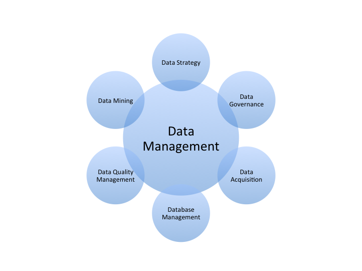
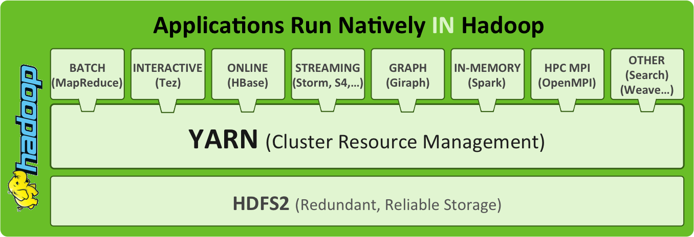
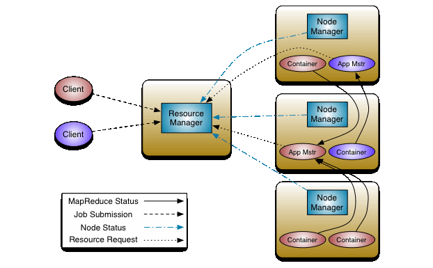
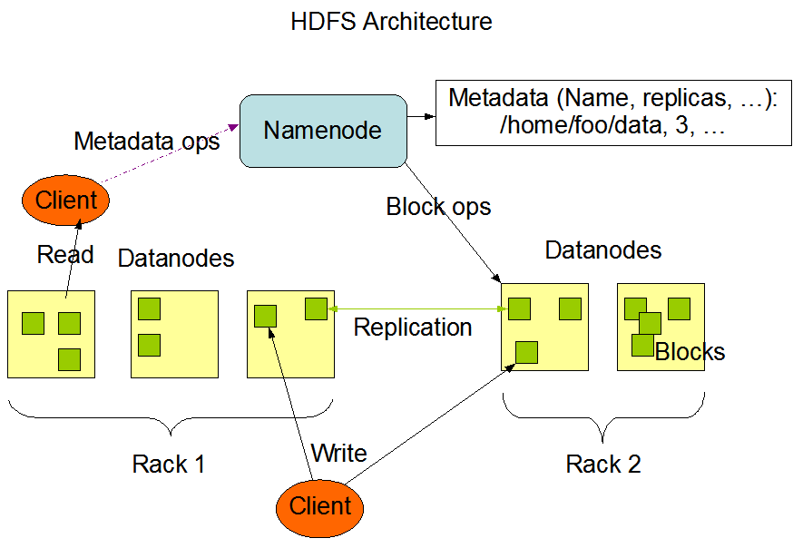
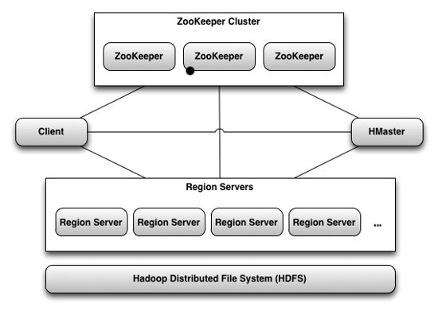
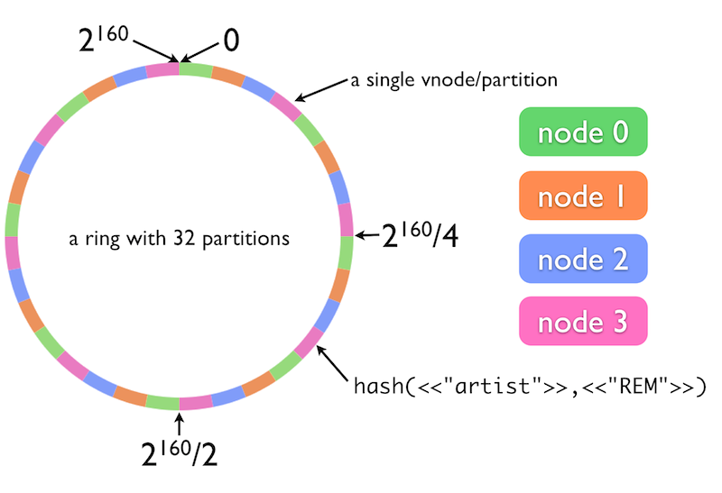
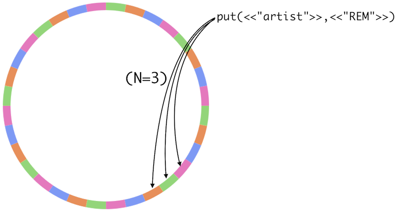
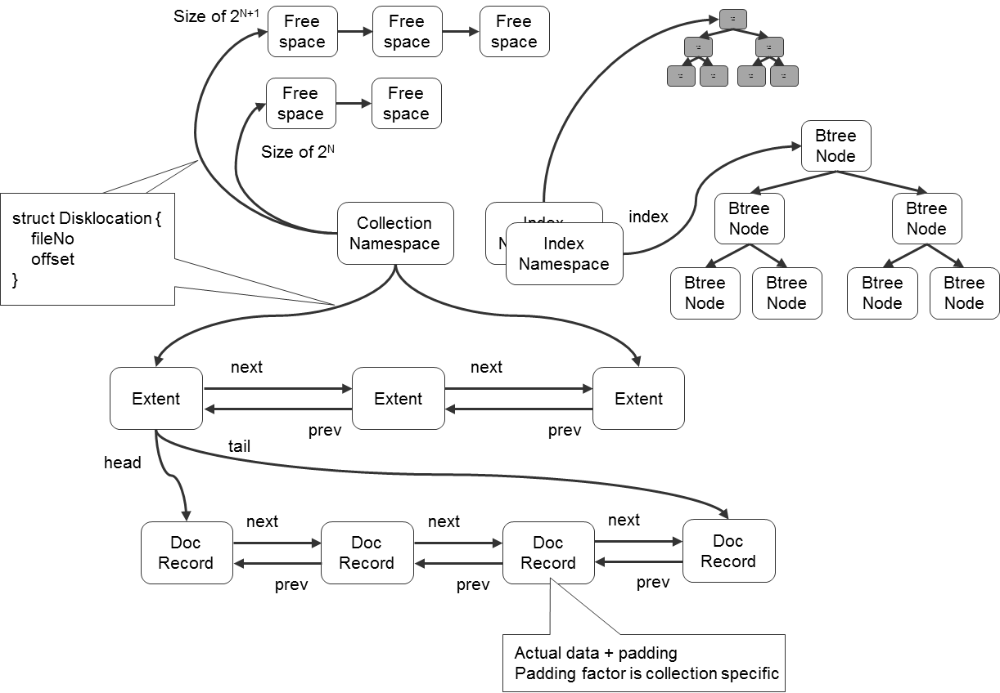
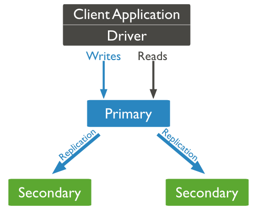

---
author:
- Haifeng Li
bibliography:
- 'bigdata.bib'
title: Introduction to Big Data
...

Introduction
============

Just like Internet, Big Data is part of our lives today. From search,
online shopping, video on demand, to e-dating, Big Data always plays an
important role behind the scene. Some people claim that Internet of
things (IoT) will take over big data as the most hyped technology
@Gartner2014. It may become true. But IoT cannot come alive without big
data. In this book, we will dive deeply into big data technologies. But
we need to understand what is big data first.

What’s Big Data?
----------------

Gartner, and now much of the industry, use the “3Vs” model @Laney2012
for describing big data:

> Big data is high volume, high velocity, and/or high variety
> information assets that require new forms of processing to enable
> enhanced decision making, insight discovery and process optimization.

It is no doubt that today’s systems are processing huge amount of data
every day. For example, Facebook’s Hive data warehouse holds 300 PB data
with an incoming daily rate of about 600 TB in April, 2014
@VagateWilfong2014! This example also shows us that big data is fast
data, too. Without high speed data generation and capture, we won’t
quickly accumulate a large amount of data to process. According to IBM,
$90\%$ of the data in the world today has been created over the last two
years alone @IBM2013. High variety (i.e. unstructured data) is another
important aspect of big data. It refers to information that either does
not have a pre-defined data model or format. Traditional data processing
systems (e.g. relational data warehouse) may handle large volume of
rigid relational data but they are not flexible to process
semi-structure or unstructured data. New technologies have to be
developed to handle data from various sources, e.g. texts, social
networks, image data, etc.

The 3Vs model nicely describe several major aspects of big data. Since
then, people also add more Vs (e.g. Variability, Veracity) to the list.
However, do 3Vs (or 4Vs, 5Vs, …) really capture the core characteristics
of big data? Probably not. We are processing data in the scale of
petabyte or even exabyte today. But big is always relative, right?
Although 1TB data is not that big today, it was big and very challenging
to process 20 years ago. Recall the fastest supercomputer in 1994,
Fujitsu Numerical Wind Tunnel, had the peak speed of 170 GFLOPS @top500.
Well, a Nvidia K40 GPU in a PC has the power of 1430 GFLOPS today
@Nvidia2014. Besides software innovations (e.g. GFS and MapReduce) also
helped a lot to process bigger and bigger data. With the advances of
technologies, today’s big data will quickly become small in tomorrow’s
standard. The same thing holds for “high velocity”. So high volume and
high velocity are not the core of big data movement even though they are
the driving force of technology advancement. How about “high variety”?
Many people read it as unstructured data which can not be well handled
by RDBMS. But unstructured data have always been there no matter how
they are stored, processed, and analyzed. We do handle text, voice,
images and videos better today with the advances of NoSQL, natural
language processing, information retrieval, computer vision, and pattern
recognition. But it is still about the technology advancement rather
than intrinsic value of big data.

From the business point of view, we may understand big data better.
Although data is a valuable corporate asset, it is not oil but just
soil. Without analysis, they are pretty much useless. But extremely
valuable knowledge and insights can be discovered from data. No matter
how you call this analytic process (data science, business intelligence,
machine learning, data mining, or information retrieval), the business
goal is the same: higher competency gained from the discovered knowledge
and insights. But wait a second. does not the idea of data analytics
exist for long time? So what’re the real differences between today’s
“big data” analytics and traditional data analytics? Looking back to web
data analysis, the origin of big data, we will find that big data means
proactively learning and understanding the customers, their needs,
behaviors, experience, and trends in near real-time and 24$\times$7. On
the other hand, traditional data analytics is passive/reactive, treats
customers as a whole or segments rather than individuals, and there is
significant time lag. Check out the applications of big data, a lot of
them is about

-   User Experience and Behavior Analysis

-   Personalization

-   Recommendation

which you rarely find in business intelligence applications [^1]. New
applications, e.g. smart grid and Internet of things, are pushing this
real-time proactive analysis forward to the whole environment and
context. Therefore, the fundamental objective of big data is to help the
organizations turn data into actionable information for identifying new
opportunities, recognizing operational issues and problems, and better
decision-making, etc. This is the driving force for corporations to
embrace big data.

How did this shift happen? The data have been changing. Traditionally,
our databases are just the systems of records, which are manually input
by people. In contrast, a big part of big data is log data, which are
generated by applications and record every interaction between users and
systems. Some people call them machine generated data to emphasize the
speed of data generation and the size of data. But the truth is that
they are triggered by human actions (event is probably a better name of
these data). The Internet of things will help us even to understand the
environment and context of user actions. The analysis on events results
in a better understanding of every single user and thus improved user
experience and bigger revenue, a lovely win-win for both customers and
business.

Business Use Cases
------------------

Big data is not just a hype but can bring great values to business. In
what follows, we will discuss some use case of big data in different
areas and industries. The list can go very long but we will focus on
several important cases to show how big data can help solving business
challenges.

### CRM

Customer relationship management (CRM) is for managing a company’s
interactions with current and future customers. By integrating big data
into a CRM solution, companies can learn customer behavior, identify
sales opportunities, analyze customers’ sentiment, and improve customer
experience to increase customer engagement and bring greater profits.

Using big data, organizations can collect more accurate and detailed
information to gain the 360 view of the customer. The analysis of all
customer touch points, including browsing history [^2], social media,
email, and call center, enable companies to gain a much more complete
and deep understanding of customer behavior – what ads attract them, why
they buy, how they shop, what they buy together, what they’ll buy next,
why they switch, how they recommend a produce/service in their social
network, etc. Once actionable insights are discovered, companies more
likely rise above industry standards.

Big data also enable comprehensive benchmarking over time. For example,
banks, telephone service companies, Internet service providers, pay TV
companies, insurance firms, and alarm monitoring services, often use
customer attrition analysis and customer attrition rates as one of their
key business metrics because the cost of retaining an existing customer
is far less than acquiring a new one @ReichheldSasser1990. Moreover, big
data enables service providers to move from reactive churn management to
proactive customer retention with predictive modeling before customers
explicitly start the switch.

### HCM

Human capital management (HCM) supposes to maximize employee performance
in service of their employer’s strategic objectives. However, current
HCM systems are mostly bookkeeping. For example, many HCM
softwares/services provide @AdpHcm

-   Enrolling or changing benefits information

-   Reporting life events such as moving or having a baby

-   Acknowledging company policies

-   Viewing pay statements and W-2 information

-   Changing W-4 tax information

-   Managing a 401(k) account

-   Viewing the company directory

-   Submitting requisition requests

-   Approving leave requests

-   Managing performance and goals

-   Viewing team calendars

These are all important HR tasks. However, they are hardly associated to
“maximize employee performance”. Even worse, current HCM systems are
passive. Taking performance and goals management as an example, one and
his/her manager enter the goals at the beginning of years and input the
performance evaluations and feedbacks at the end of year. So what? If
low performance happened, it has already happened for most of a year!

With big data, HCM systems can help HR practitioners and managers to
actively measure, monitor and improve employee performance. Although it
is pretty hard to measure employee performance in real time, especially
for long term projects, studies show a clear correlation between
engagement and performance – and most importantly between improving
engagement and improving performance @MacLeodClarke2012. That is,
organizations with a highly engaged workforce significantly outperform
those without.

Engagement analytics has been an active research area in CRM and many
technologies can be borrowed to HCM. For example, churn analysis can be
used to understand the underlying patterns of employee turnover. With
big data, HCM systems can predict which high-performing employees are
likely to leave a company in the next year and then offers possible
actions (higher compensation and/or new job) that might make them stay.
For corporations, we simply want to know our employees as well as we
know our customers. From this point of view, it does make a lot of sense
to connect HCM and CRM together with big data to shorten the
communication paths between inside and outside world.

### IoT

The Internet of Things is the interconnection of uniquely identifiable
embedded computing devices within the Internet infrastructure. IoT is
representing the next big wave in the evolution of the Internet. The
combination of big data and IoT is producing huge opportunities for
companies in all industries. Industries such as manufacturing, mobility
and retail have already been leveraging the data generated by billions
of devices to provide new levels of operational and business insights.

Industrial companies are progressing in creating financial value by
gathering and analyzing vast volumes of machine sensor data
@IndustrialInternetReport2014. Additionally, some companies are
progressing to leverage insights from machine asset data to create
efficiencies in operations and drive market advantages with greater
confidence. For example, Thames Water Utilities Limited, the largest
provider of water and wastewater services in the UK, is using sensors,
analytics and real-time data to help the utility respond more quickly to
critical situations such as leaks or adverse weather events
@Accenture14SmartGrid.

Smart grid, an advanced application of IoT, is profoundly changing the
fundamentals of urban areas throughout the world. Multiple cities around
the world are conducting the so called smart city trials. For example,
the city of Seattle is applying analytics to optimize energy usage by
identifying equipment and system inefficiencies, and alerting building
managers to areas of wasted energy. Elements in each room of a building
– such as lighting, temperature and the position of window shades – can
then be adjusted, depending on data readings, to maximize efficiency
@Accenture13Seattle.

### Healthcare

Healthcare is a big industry and contribute to a significant part of a
country’s economy (in fact 17.7% of GDP in USA). Big data can improve
our ability to treat illnesses, e.g. recognizing individuals who are at
risk for serious health problems. It can also identify waste in the
healthcare system and thus lower the cost of healthcare across the
board.

A recent exciting advance in applying big data to healthcare is IBM
Watson. IBM Watson is an artificially intelligent computer system
capable of answering questions posed in natural language @Watson2014.
Watson may work as a clinical decision support system for medical
professionals based on its natural language, hypothesis generation, and
evidence-based learning capabilities @Watson2013Healthcare
[@Watson2013Cancer]. When a doctor asks Watson about symptoms and other
related factors, Watson first parses the input to identify the most
important pieces of information; then mines patient data to find facts
relevant to the patient’s medical and hereditary history; then examines
available data sources to form and test hypotheses; and finally provides
a list of individualized, confidence-scored recommendations. The sources
of data that Watson uses for analysis can include treatment guidelines,
electronic medical record data, notes from doctors and nurses, research
materials, clinical studies, journal articles, and patient information.

Data Management
---------------

Data is a corporate asset. But it is firstly a debt. The costs of data
acquisition, hardware, software, operation, and talents are very high.
Without right management, it is unlikely for us to effectively extract
the value from data. To make big data a success, we must have all the
disciplines to manage data as a valuable resource. Data management is
much broader than database management. It is a systematic process of
capturing, delivering, operating, protecting, enhancing, and disposing
of data cost-effectively, which needs the ever-going reinforcement of
plans, policies, programs and practices.

The ultimate goal of data management is to increase the value
proposition of data. It requires serious and careful consideration and
should start with a data strategy that defines a roadmap to meet the
business needs in a data-driven approach. To create a data strategy,
think carefully the following questions:

-   What problem do we try to solve? What value can big data bring in?
    Big data is hot and thus many corporations are hugging it. However,
    big data for big data is apparently wrong. Other’s use cases do not
    have to be yours. To glean the value of big data, a deep
    understanding of your business and problems to solve is essential.

-   Who hold the data, who own the data, and who can access the data?
    Data governance is a set of processes that ensures that important
    data assets are formally managed throughout the enterprise. Through
    data governance, we expect data stewards and data custodians to
    exercise positive control over the data. Data custodians are
    responsible for the safe custody, transport, and storage of the data
    while data stewards are responsible for the management of data
    elements – both the content and metadata.

-   What data do we need? It may seem obvious, but it is often simply
    answered with “I do not know” or “Everything”, which indicates a
    lack of understanding business practices. Whenever this happens, we
    should go back to answer the first question again. How to acquire
    the data? Data may be collected from internal system of records, log
    files, surveys, or third parties. The transactional systems may be
    revised to collect necessary data for analytics.

-   Where to store the data and how long to keep them? Due to the
    variety of data, today’s data may be stored in various databases
    (relational or NoSQL), data warehouses, Hadoop, etc. Today, database
    management is way beyond relational database administration. Because
    big data is also fast data, it is impractical to keep all of the
    data forever. Careful thoughts are needed to determine the lifespan
    of data.

-   How to ensure the data quality? Junk in, Junk out. Without ensuring
    the data quality, big data won’t bring any values to the business.
    With the advent of big data, data quality management is both more
    important and more challenging than ever.

-   How to analyze and visualize the data? A large number of
    mathematical models are available for analyzing data. Simply
    applying mathematical models does not necessarily result in
    actionable insights. Before talking about your mathematical models,
    go understand your business and problems. Lead the model with your
    insights (or *a priori* in terms of machine learning)
    rather than be lead by the uninterpretable numbers of black
    box models. Besides, visualization is extremely helpful to explore
    data and present the analytic results as a picture is worth a
    thousand words.

-   How to manage the complexity? Big data is extremely complicated. To
    manage the complexity and improve the data management practices, we
    need to develop the accountability framework to encourage desirable
    behavior, which is tailored to the organization’s business
    strategies, strengths and priorities.

Hadoop
======

Big data unavoidably needs distributed parallel computing on a cluster
of computers. Therefore, we need a distributed data operating system to
manage a variety of resources, data, and computing tasks. Today, Apache
Hadoop @Hadoop is the de facto distributed data operating system. Apache
Hadoop is an open-source software framework for distributed storage and
distributed processing of big data on clusters of commodity hardware.
Essentially, Hadoop consists of three parts:

-   YARN for job scheduling and cluster resource management

-   HDFS is a distributed high-throughput file system

-   MapReduce for job framework of parallel data processing

The HDFS splits files into large blocks that are distributed (and
replicated) among the nodes in the cluster. For processing the data,
MapReduce takes advantage of data locality by shipping code to the nodes
that have the required data and processing the data in parallel.

Today the Hadoop ecosystem goes beyond the base package and includes
many additional software packages that can be installed on top of or
alongside Hadoop, such as Apache Hive, Apache Spark, Apache Storm, etc.
In this chapter, we will discuss the core of Hadoop, i.e. YARN, HDFS,
and MapReduce. We will also discuss the related software such as Mesos,
Tez, Spark, and ZooKeeper.

Cluster Management
------------------

Large-scale computer clusters are challenging to utilize efficiently.
One of the critical tasks of cluster management is to dispatch work for
the cluster to perform. The scheduler, assigning jobs to machines, has
to take account of a variety of requirements and policies. With the
ever-growing size of data, cluster, and workload, the scheduler may
become a scalability bottleneck @Schwarzkopf:2013:OFS.

### YARN

Originally, Hadoop was restricted mainly to the paradigm MapReduce,
where the resource management is done by JobTracker and TaskTacker. The
JobTracker farms out MapReduce tasks to specific nodes in the cluster,
ideally the nodes that have the data, or at least are in the same rack.
A TaskTracker is a node in the cluster that accepts tasks - Map, Reduce
and Shuffle operations - from a JobTracker. Because Hadoop has stretched
beyond MapReudce (e.g. HBase, Storm, etc.), Hadoop now architecturally
decouples the resource management features from the programming model of
MapReduce, which makes Hadoop clusters more generic. The new resource
manager is referred to as MapReduce 2.0 (MRv2) or YARN @YARN2011:279.
Now MapReduce is one kind of applications running in a YARN container
and other types of applications can be written generically to run on
YARN.

YARN employs a master-slave model and includes several components:

-   The global Resource Manager is the ultimate authority that
    arbitrates resources among all applications in the system.

-   The per-application Application Master negotiates resources from the
    Resource Manager and works with the Node Managers to execute and
    monitor the component tasks.

-   The per-node slave Node Manager is responsible for launching the
    applications’ containers, monitoring their resource usage and
    reporting to the Resource Manager.

The Resource Manager, consisting of Scheduler and Application Manager,
is the central authority that arbitrates resources among various
competing applications in the cluster. The Scheduler is responsible for
allocating resources to the various running applications subject to the
constraints of capacities, queues etc. The Application Manager is
responsible for accepting job-submissions, negotiating the first
container for executing the application specific Application Master and
provides the service for restarting the Application Master container on
failure.

The Scheduler uses the abstract notion of a Resource Container which
incorporates elements such as memory, CPU, disk, network etc. Initially,
YARN uses the memory-based scheduling. Each node is configured with a
set amount of memory and applications request containers for their tasks
with configurable amounts of memory. Recently, YARN added CPU as a
resource in the same manner. Nodes are configured with a number of
“virtual cores” (vcores) and applications give a vcore number in the
container request.

The Scheduler has a pluggable policy plug-in, which is responsible for
partitioning the cluster resources among the various queues,
applications etc. For example, the Capacity Scheduler is designed to
maximize the throughput and the utilization of shared, multi-tenant
clusters. Queues are the primary abstraction in the Capacity Scheduler.
The capacity of each queue specifies the percentage of cluster resources
that are available for applications submitted to the queue. Furthermore,
queues can be set up in a hierarchy. YARN also sports a Fair Scheduler
that tries to assign resources to applications such that all
applications get an equal share of resources over time on average using
dominant resource fairness @Ghodsi:2011:DRF.

The protocol between YARN and applications is as follows. First an
Application Submission Client communicates with the Resource Manager to
acquire a new Application Id. Then it submit the Application to be run
by providing sufficient information (e.g. the local files/jars, command
line, environment settings, etc.) to the Resource Manager to launch the
Application Master. The Application Master is then expected to register
itself with the Resource Manager and request for and receive containers.
After a container is allocated to it, the Application Master
communicates with the Node Manager to launch the container for its task
by specifying the launch information such as command line specification,
environment, etc. The Application Master also handles failures of job
containers. Once the task is completed, the Application Master signals
the Resource Manager.

As the central authority of the YARN cluster, the Resource Manager is
also the single point of failure (SPOF). To make it fault tolerant, an
Active/Standby architecture can be employed since Hadoop 2.4. Multiple
Resource Manager instances (listed in the configuration file
yarn-site.xml) can be brought up but only one instance is Active at any
point of time while others are in Standby mode. When the Active goes
down or becomes unresponsive, another Resource Manager is automatically
elected by a ZooKeeper-based method to be the Active. ZooKeeper is a
replicated CP key-value store, which we will discuss in details later.
Clients, Application Masters and Node Managers try connecting to the
Resource Managers in a round-robin fashion until they hit the new
Active.

### Mesos

Mesos @Hindman:2011:MPF is another cluster resource management software
from Apache. Mesos uses the master-slave architecture similar to YARN
but with a very different design goal. Mesos aims to enable sharing
clusters between multiple diverse cluster computing frameworks, such as
Hadoop, Spark [^3] and MPI. This improves cluster utilization and avoids
per-framework data replication.

Mesos introduces a distributed two-level scheduling mechanism [^4] and
delegates control over scheduling to the frameworks. This allows
frameworks to implement diverse approaches to various problems in the
cluster and to evolve these solutions independently.

Mesos consists of a master process that manages slave daemons running on
each cluster node, and frameworks that run tasks on these slaves. The
master implements resource sharing using through the abstraction
*resource offer*, which encapsulates a bundle of resources
that a framework can allocate on a cluster node to run tasks. The master
decides how many resources to offer to each framework according to some
(pluggable) policy.

A framework running on top of Mesos consists of two components: a
scheduler that registers with the master to be offered resources, and an
executor process that is launched on slave nodes to run the framework’s
tasks. Resource offers are simple and efficient to implement, allowing
Mesos to be highly scalable and robust to failures.

HDFS
----

Hadoop Distributed File System (HDFS) @HDFS is a multi-machine file
system that runs on top of machines’ local file system but appears as a
single namespace, accessible through `hdfs://` URIs. It is designed to
reliably store very large files across machines in a large cluster of
inexpensive commodity hardware. HDFS closely follows the design of the
Google File System (GFS) @Ghemawat:2003:GFS [@McKusick:2009:GEF].

### Assumptions

An HDFS instance may consist of hundreds or thousands of nodes, which
are made of inexpensive commodity components that often fail. It implies
that some components are virtually not functional at any given time and
some will not recover from their current failures. Therefore, constant
monitoring, error detection, fault tolerance, and automatic recovery
would have to be an integral part of the file system.

HDFS is tuned to support a modest number (tens of millions) of large
files, which are typically gigabytes to terabytes in size. Initially,
HDFS assumes a write-once-read-many access model for files. A file once
created, written, and closed need not be changed. This assumption
simplifies the data coherency problem and enables high throughput data
access. The append operation was added later (single appender only)
@HDFS2010:265.

HDFS applications typically have large streaming access to their
datasets. HDFS is mainly designed for batch processing rather than
interactive use. The emphasis is on high throughput of data access
rather than low latency.

### Architecture

HDFS is built using the Java language and has a master/slave
architecture. An HDFS cluster consists of a single NameNode, a master
server that manages the file system namespace and regulates access to
files by clients. In addition, there are a number of DataNodes\
indexHDFS!NameNode that manage storage attached to the
nodes that they run on. A typical deployment has a dedicated machine
that runs only the NameNode. Each of the other machines in the cluster
runs one instance of the DataNode [^5].

HDFS supports a traditional hierarchical file organization that consists
of directories and files. In HDFS, each file is stored as a sequence of
blocks (identified by 64 bit unique id); all blocks in a file except the
last one are the same size (typically 64 MB). DataNodes store each block
in a separate file on local file system and provide read/write access.
When a DataNode starts up, it scans through its local file system and
sends the list of hosted data blocks (called Blockreport) to the
NameNode.

For reliability, each block is replicated on multiple DataNodes (three
replicas by default). The placement of replicas is critical to HDFS
reliability and performance. HDFS employs a rack-aware replica placement
policy to improve data reliability, availability, and network bandwidth
utilization. When the replication factor is three, HDFS puts one replica
on one node in the local rack, another on a different node in the same
rack, and the last on a node in a different rack. This policy reduces
the inter-rack write traffic which generally improves write performance.
Since the chance of rack failure is far less than that of node failure,
this policy does not impact data reliability and availability notably.

The NameNode is the arbitrator and repository for all HDFS metadata. The
NameNode executes common namespace operations such as create, delete,
modify and list files and directories. The NameNode also performs the
block management including mapping files to blocks, creating and
deleting blocks, and managing replica placement and re-replication.
Besides, the NameNode provides DataNode cluster membership by handling
registrations and periodic heart beats. But the user data never flows
through the NameNode.

To achieve high performance, the NameNode keeps all metadata in main
memory including the file and block namespace, the mapping from files to
blocks, and the locations of each block’s replicas. The namespace and
file-to-block mapping are also kept persistent into the files EditLog
and FsImage in the local file system of the NameNode. The file FsImage
stores the entire file system namespace and file-to-block map. The
EditLog is a transaction log to record every change that occurs to file
system metadata, e.g. creating a new file and changing the replication
factor of a file. When the NameNode starts up, it reads the FsImage and
EditLog from disk, applies all the transactions from the EditLog to the
in-memory representation of the FsImage, flushes out the new version of
FsImage to disk, and truncates the EditLog.

Because the NameNode replays the EditLog and updates the FsImage only
during start up, the EditLog could get very large over time and the next
restart of NameNode takes longer. To avoid this problem, HDFS has a
secondary NameNode that updates the FsImage with the EditLog
periodically and keeps the EditLog within a limit. Note that the
secondary NameNode is not a standby NameNode. It usually runs on a
different machine from the primary NameNode since its memory
requirements are on the same order as the primary NameNode.

The NameNode does not store block location information persistently. On
startup, the NameNode enters a special state called Safemode and
receives Blockreport messages from the DataNodes. Each block has a
specified minimum number of replicas. A block is considered safely
replicated when the minimum number of replicas has checked in with the
NameNode. After a configurable percentage of safely replicated data
blocks checks in with the NameNode (plus an additional 30 seconds), the
NameNode exits the Safemode state.

### Control and Data Flow

HDFS is designed such that clients never read and write file data
through the NameNode. Instead, a client asks the NameNode which
DataNodes it should contact using the class ClientProtocol through an
RPC connection. Then the client communicates with a DataNode directly to
transfer data using the DataTransferProtocol, which is a streaming
protocol for performance reasons. Besides, all communication between
Namenode and Datanode, e.g. DataNode registration, heartbeat,
Blockreport, is initiated by the Datanode, and responded to by the
Namenode.

#### Read

First, the client queries the NameNode with the file name, read range
start offset, and the range length. The NameNode returns the locations
of the blocks of the specified file within the specified range.
Especially, DataNode locations for each block are sorted by the
proximity to the client. The client then sends a request to one of the
DataNodes, most likely the closest one.

#### Write

A client request to create a file does not reach the NameNode
immediately. Instead, the client caches the file data into a temporary
local file. Once the local file accumulates data worth over one block
size, the client contacts the NameNode, which updates the file system
namespace and returns the allocated data block location. Then the client
flushes the block from the local temporary file to the specified
DataNode. When a file is closed, the remaining last block data is
transferred to the DataNodes.

### The Small Files Problem

Big data but small files (significantly smaller than the block size)
implies a lot of files, which creates a big problem for the NameNode
@SmallFiles. Recall that the NameNode holds all the metadata of files
and blocks in main memory. Given that each of the metadata object
occupies about 150 bytes, the NameNode may host about 10 million files,
each using a block, with 3 gigabytes of memory. Although larger memory
can push the upper limit higher, large heap is a big challenge for JVM
garbage collector. Furthermore, HDFS is not efficient to read small
files because of the overhead of client-NameNode communication, too much
disk seeks, and lots of hopping from DataNode to DataNode to retrieve
each small file.

In order to reduce the number of files and thus the pressure on the
NameNode’s memory, Hadoop Archives (HAR files) were introduced. HAR
files, created by `hadoop archive` [^6] command, are special format
archives that contain metadata and data files. The archive exposes
itself as a file system layer. All of the original files are visible and
accessible through a `har://` URI. It is also easy to use HAR files as
input file system in MapReduce. Note that it is actually slower to read
through files in a HAR because of the extra access to metadata.

The SequenceFile, consisting of binary key-value pairs, can also be used
to handle the small files problem, by using the filename as the key and
the file contents as the value. This works very well in practice for
MapReduce jobs. Besides, the SequenceFile supports compression, which
reduces disk usage and speeds up data loading in MapReduce. Open source
tools exist to convert tar files to SequenceFiles @Tar2Seq.

The key-value stores, e.g. HBase and Accumulo, may also be used to
reduce file count although they are designed for much more complicated
use cases. Compared to SequenceFile, they support random access by keys.

### HDFS Federation

The existence of a single NameNode in a cluster greatly simplifies the
architecture of the system. However, it also introduces problems. The
file count problem, due to the limited memory of NameNode, is an
example. A more serious problem is that it proved to be a bottleneck for
the clients @McKusick:2009:GEF. Even though the clients issue few
metadata operations to the NameNode, there may be thousands of clients
all talking to the NameNode at the same time. With multiple MapReduce
jobs, we might suddenly have thousands of tasks in a large cluster, each
trying to open a number of files. Given that the NameNode is capable of
doing only a few thousand operations a second, it would take a long time
to handle all those requests.

Since Hadoop 2.0, we can have two redundant NameNodes in the same
cluster in an active/passive configuration with a hot standby. Although
this allows a fast failover to a new NameNode for fault tolerance, it
does not solve the the performance issue. To partially resolve the
scalability problem, the concept of HDFS Federation, was introduced to
allow multiple namespaces within a HDFS cluster. In the future, it may
also support the cooperation across clusters.

In HDFS Federation, there are multiple independent NameNodes (and thus
multiple namespaces). The NameNodes do not require coordination with
each other. The DataNodes are used as the common storage by all the
NameNodes by registering with and handles commands from all the
NameNodes in the cluster. The failure of a NameNode does not prevent the
DataNode from serving other NameNodes in the cluster.

Because multiple NameNodes run independently, there may be conflicts of
64 bit block ids generated by different NameNodes. To avoid this
problem, a namespace uses one or more block pools, identified by a
unique id in a cluster. A block pool belongs to a single namespace and
does not cross namespace boundary. The extended block id, a tuple of
(Block Pool ID, Block ID), is used for block identification in HDFS
Federation.

### Java API

HDFS is implemented in Java and provides a native Java API. To access
HDFS in other programming languages, Thrift [^7] bindings are provided
for Perl, Python, Ruby and PHP @HdfsThrift. In what follows, we will
discuss how to work with HDFS Java API with a couple of small examples.
First of all, we need to add the following dependencies to the project’s
Maven POM file @Maven.

    <dependency>
        <groupId>org.apache.hadoop</groupId>
        <artifactId>hadoop-common</artifactId>
        <version>2.6.0</version>
    </dependency>
    <dependency>
        <groupId>org.apache.hadoop</groupId>
        <artifactId>hadoop-hdfs</artifactId>
        <version>2.6.0</version>
    </dependency>

The main entry point of HDFS Java API is the abstract class `FileSystem`
in the package `org.apache.hadoop.fs` that serves as a generic file
system representation. `FileSystem` has various implementations:

DistributedFileSystem

:   The implementation of distributed file system. This object is the
    way end-user code interacts with an HDFS.

LocalFileSystem

:   The local implementation for small Hadoop instances and for testing.

FTPFileSystem

:   A FileSystem backed by an FTP client.

S3FileSystem

:   A block-based FileSystem backed by Amazon S3.

The `FileSystem` class also serves as a factory for concrete
implementations:

    Configuration conf = new Configuration();
    FileSystem fs = FileSystem.get (conf);

where the `Configuration` class passes the Hadoop configuration
information such as scheme, authority, NameNode host and port, etc..
Unless explicitly turned off, Hadoop by default specifies two resources,
loaded in-order from the classpath:

core-default.xml

:   Read-only defaults for Hadoop.

core-site.xml

:   Site-specific configuration for a given Hadoop installation.

Applications may add additional resources, which are loaded subsequent
to these resources in the order they are added. With `FileSystem`, one
can do common namespace operations, e.g. creating, deleting, and
renaming files. We can also query the status of a file such as the
length, block size, block locations, permission, etc. To read or write
files, we need to use the classes `FSDataInputStream` and
`FSDataOutputStream`. In the following example, we develop two simple
functions to copy a local file into/from HDFS. For simplicity, we do not
check the file existence or any I/O errors. Note that `FileSystem` does
provides several utility functions for copying files between local and
distributed file systems.

    /** Copy a local file to HDFS */
    public void copyFromLocal(String src, String dst) throws IOException {
     
      Configuration conf = new Configuration();
      FileSystem fs = FileSystem.get(conf);
      
      // The Path object represents a file or directory in HDFS.
      FSDataOutputStream out = fs.create(new Path(dst));
      InputStream in = new BufferedInputStream(new FileInputStream(new File(src)));
     
      byte[] b = new byte[1024];
      int numBytes = 0;
      while ((numBytes = in.read(b)) > 0) {
        out.write(b, 0, numBytes);
      }
     
      in.close();
      out.close();
      fs.close();
    }

    /** Copy an HDFS file to local file system */
    public void copyToLocal(String src, String dst) throws IOException {
     
      Configuration conf = new Configuration();
      FileSystem fs = FileSystem.get(conf);
     
      FSDataInputStream in = fs.open(new Path(src));
      OutputStream out = new BufferedOutputStream(new FileOutputStream(new File(dst)));
      byte[] b = new byte[1024];
      int numBytes = 0;
      while ((numBytes = in.read(b)) > 0) {
        out.write(b, 0, numBytes);
      }
     
      in.close();
      out.close();
      fs.close();
    }

In the example, we use the method `FileSystem.create` to create an
`FSDataOutputStream` at the indicated `Path`. If the file exists, it
will be overwritten by default. The `Path` object is used to locate a
file or directory in HDFS. `Path` is really a URI. For HDFS, it takes
the format of `hdfs://host: port/location`. To read an HDFS file, we use
the method `FileSystem.open` that returns an `FSDataInputStream` object.
The rest of example is just as the regular Java I/O stream operations.

### Data Ingestion

Today, most data are generated and stored out of Hadoop, e.g. relational
databases, plain files, etc. Therefore, data ingestion is the first step
to utilize the power of Hadoop. To move the data into HDFS, we do not
have to do the low level programming as the previous example. Various
utilities have been developed to move data into Hadoop.

#### Batch Data Ingestion

The File System Shell @HdfsShell includes various shell-like commands,
including `copyFromLocal` and `copyToLocal`, that directly interact with
the HDFS as well as other file systems that Hadoop supports. Most of the
commands in File System Shell behave like corresponding Unix commands.
When the data files are ready in local file system, the shell is a great
tool to ingest data into HDFS in batch. In order to stream data into
Hadoop for real time analytics, however, we need more advanced tools,
e.g. Apache Flume and Apache Chukwa.

#### Streaming Data Ingestion

Apache Flume @Flume is a distributed, reliable, and available service
for efficiently collecting, aggregating, and moving large amounts of log
data into HDFS. It has a simple and flexible architecture based on
streaming data flows; and robust and fault tolerant with tunable
reliability mechanisms and many failover and recovery mechanisms. It
uses a simple extensible data model that allows for online analytic
application. Flume employs the familiar producer-consumer model.
`Source` is the entity through which data enters into Flume. Sources
either actively poll for data or passively wait for data to be delivered
to them. On the other hand, `Sink` is the entity that delivers the data
to the destination. Flume has many built-in sources (e.g. log4j and
syslogs) and sinks (e.g. HDFS and HBase). `Channel` is the conduit
between the Source and the Sink. Sources ingest events into the channel
and the sinks drain the channel. Channels allow decoupling of ingestion
rate from drain rate. When data are generated faster than what the
destination can handle, the channel size increases.

Apache Chukwa @Chukwa is devoted to large-scale log collection and
analysis, built on top of MapReduce framework. Beyond data ingestion,
Chukwa also includes a flexible and powerful toolkit for displaying
monitoring and analyzing results. Different from Flume, Chukwa is not a
a continuous stream processing system but a mini-batch system.

Apache Kafka @Kafka and Apache Storm @Storm may also be used to ingest
streaming data into Hadoop although they are mainly designed to solve
different problems. Kafka is a distributed publish-subscribe messaging
system. It is designed to provide high throughput persistent messaging
that’s scalable and allows for parallel data loads into Hadoop. Storm is
a distributed realtime computation system for use cases such as realtime
analytics, online machine learning, continuous computation, etc.

#### Structured Data Ingestion

Apache Sqoop @Sqoop is a tool designed to efficiently transfer data
between Hadoop and relational databases. We can use Sqoop to import data
from a relational database table into HDFS. The import process is
performed in parallel and thus generates multiple files in the format of
delimited text, Avro, or SequenceFile. Besides, Sqoop generates a Java
class that encapsulates one row of the imported table, which can be used
in subsequent MapReduce processing of the data. Moreover, Sqoop can
export the data (e.g. the results of MapReduce processing) back to the
relational database for consumption by external applications or users.

MapReduce
---------

Distributed parallel computing is not new. Supercomputers have been
using MPI @Forum:1994:MMI for years for complex numerical computing.
Although MPI provides a comprehensive API for data transfer and
synchronization, it is not very suitable for big data. Due to the large
data size and shared-nothing architecture for scalability, data
distribution and I/O are critical to big data analytics while MPI almost
ignores it [^8]. On the other hand, many big data analytics are
conceptually straightforward and does not need very complicated
communication and synchronization mechanism. Based on these
observations, Google invented MapReduce @Dean:2008:MSD to deal the
issues of how to parallelize the computation, distribute the data, and
handle failures.

### Overview

In a shared-nothing distributed computing environment, a computation is
much more efficient if it is executed near the data it operates on. This
is especially true when the size of the data set is huge as it minimizes
network traffic and increases the overall throughput of the system.
Therefore, it is often better to migrate the computation closer to where
the data is located rather than moving the data to where the application
is running. With GFS/HDFS, MapReduce provides such a parallel
programming framework.

Inspired by the `map` and `reduce`[^9] functions commonly used in
functional programming, a MapReduce program is composed of a Map()
procedure that performs transformation and a Reduce() procedure that
takes the shuffled output of Map as input and performs a summarization
operation. More specifically, the user-defined Map function processes a
key-value pair to generate a set of intermediate key-value pairs, and
the Reduce function aggregates all intermediate values associated with
the same intermediate key.

MapReduce applications are automatically parallelized and executed on a
large cluster of commodity machines. During the execution, the Map
invocations are distributed across multiple machines by automatically
partitioning the input data into a set of M splits. The input splits can
be processed in parallel by different machines. Reduce invocations are
distributed by partitioning the intermediate key space into R pieces
using a partitioning function. The number of partitions and the
partitioning function are specified by the user. Besides partitioning
the input data and running the various tasks in parallel, the framework
also manages all communications and data transfers, load balance, and
fault tolerance.

MapReduce provides programmers a really simple parallel computing
paradigm. Because of automatic parallelization, no explicit handling of
data transfer and synchronization in programs, and no deadlock, this
model is very attractive. MapReduce is also designed to process very
large data that is too big to fit into the memory (combined from all
nodes). To achieve that, MapReduce employs a data flow model, which also
provides a simple I/O interface to access large amount of data in
distributed file system. It also exploits data locality for efficiency.
In most cases, we do not need to worry about I/O at all.

### Data Flow

For a given task, the MapReduce system runs as follows

Prepare the Map() input

:   The system splits the input files into M pieces and then starts up M
    Map workers on a cluster of machines.

Run the user-defined Map() code

:   The Map worker parses key-value pairs out of the assigned split and
    passes each pair to the user-defined Map function. The intermediate
    key-value pairs produced by the Map function are buffered in memory.
    Periodically, the buffered pairs are written to local disk,
    partitioned into R regions for sharding purposes by the partitioning
    function (called partitioner) that is given the key and the number
    of reducers R and returns the index of the desired reducer.

Shuffle the Map output to the Reduce processors

:   When ready, a reduce worker reads remotely the buffered data from
    the local disks of the map workers. When a reduce worker has read
    all intermediate data, it sorts the data by the intermediate keys so
    that all occurrences of the same key are grouped together. Typically
    many different keys map to the same reduce task.

Run the user-defined Reduce() code

:   The reduce worker iterates over the sorted intermediate data and for
    each unique intermediate key encountered, it passes the key and the
    corresponding set of intermediate values to the user’s
    Reduce function.

Produce the final output

:   The final output is available in the R output files (one per
    reduce task).

Optionally, a combiner can be used between map and reduce as an
optimization. The combiner function runs on the output of the map phase
and is used as a filtering or an aggregating step to lessen the data
that are being passed to the reducer. In most of the cases the reducer
class is set to be the combiner class so that we can save network time.
Note that this works only if reduce function is commutative and
associative.

In practice, one should pay attention to the task granularity, i.e. the
number of map tasks M and the number of reduce tasks R. In general, M
should be much larger than the number of nodes in cluster, which
improves load balancing and speeds recovery from worker failure. The
right level of parallelism for maps seems to be around 10-100 maps per
node (maybe more for very cpu light map tasks). Besides, the task setup
takes awhile. On a Hadoop cluster of 100 nodes, it takes 25 seconds
until all nodes are executing the job. So it is best if the maps take at
least a minute to execute. In Hadoop, one can call
`JobConf.setNumMapTasks(int)` to set the number of map tasks. Note that
it only provides a hint to the framework.

The number of reducers is usually a small multiple of the number of
nodes. The right factor number seems to be 0.95 for well-balanced data
(per intermediate key) or 1.75 otherwise for better load balancing. Note
that we reserve a few reduce slots for speculative tasks and failed
tasks. We can set the number of reduce tasks by
`JobConf.setNumReduceTasks(int)` in Hadoop and the framework will honor
it. It is fine to set R to zero if no reduction is desired.

### Secondary Sorting

The output of Mappers is firstly sorted by the intermediate keys.
However, we do want to sort the intermediate values (or some fields of
intermediate values) sometimes, e.g. calculating the stock price moving
average where the key is the stock ticker and the value is a pair of
timestamp and stock price. If the values of a given key are sorted by
the timestamp, we can easily calculate the moving average with a sliding
window over the values. This problem is called secondary sorting.

A direct approach to secondary sorting is for the reducer to buffer all
of the values for a given key and do an in-memory sort. Unfortunately,
it may cause the reducer to run out of memory.

Alternatively, we may use a composite key that has multiple parts. In
the case of calculating moving average, we may create a composite key of
(ticker, timestamp) and also provide a customized sort comparator
(subclass of `WritableComparator`) that compares ticker and then
timestamp. To ensure only the ticker (referred as natural key) is
considered when determining which reducer to send the data to, we need
to write a custom partitioner (subclass of `Partitioner`) that is solely
based on the natural key. Once the data reaches a reducer, all data is
grouped by key. Since we have a composite key, we need to make sure
records are grouped solely by the natural key by implementing a group
comparator (another subclass of `WritableComparator`) that considers
only the natural key.

### Examples

Hadoop implements MapReduce in Java. To create a MapReduce program,
please add the following dependencies to the project’s Maven POM file.

    <dependency>
        <groupId>org.apache.hadoop</groupId>
        <artifactId>hadoop-common</artifactId>
        <version>2.6.0</version>
    </dependency>
    <dependency>
        <groupId>org.apache.hadoop</groupId>
        <artifactId>hadoop-mapreduce-client-core</artifactId>
        <version>2.6.0</version>
    </dependency>
    <dependency>
        <groupId>org.apache.hadoop</groupId>
        <artifactId>hadoop-hdfs</artifactId>
        <version>2.6.0</version>
    </dependency>

#### Sort

The essential part of the MapReduce framework is a large distributed
sort. So we just let the framework do the job in this case while the map
is as simple as emitting the sort key and original input. In the below
example, we just assume the input key is the sort key. The reduce
operator is an identity function.

    public class SortMapper extends Mapper<IntWritable, Text, IntWritable, Text> {

      public void map(IntWritable key, Text value, Context context)
        throws IOException, InterruptedException {
        context.write(key, value);
      }
    }

    public class SortReducer extends Reducer<IntWritable, Text, IntWritable, Text> {

      public void reduce(IntWritable key, Iterable<Text> values, Context context)
        throws IOException, InterruptedException {
        for (Text value : values) {
          context.write(key, value);
        }
      }
    }

Although this example is extremely simple, there are many important
classes to understand. The MapReduce framework takes key-value pairs as
the input and produces a new set of key-value pairs (maybe of different
types). The key and value classes have to be serializable by the
framework and hence need to implement the `Writable` interface.
Additionally, the key classes have to implement the `WritableComparable`
interface to facilitate sorting by the framework.

The `map` method of `Mapper` implementation processes one key-value pair
in the input split at a time. The `reduce` method of `Reducer`
implementation is called once for each intermediate key and associate
group of values. In this case, we do not have to override the `map` and
`reduce` methods because the default implementation is actually an
identity function. The sample code is mainly to show the interface. Both
`Mapper` and `Reducer` emit their output through the `Context` object
provided by the framework.

To submit a MapReduce job to Hadoop, we need to do the below steps.
First, the application describes various facets of the job via `Job`
object. `Job` is typically used to specify the `Mapper`, `Reducer`,
`InputFormat`, `OutputFormat` implementations, the directories of input
files and the location of output files. Optionally, one may specify
advanced facets of the job such as the Combiner, Partitioner,
Comparator, and DistributedCache, etc. Then the application submits the
job to the cluster by the method `waitForCompletion(boolean verbose)`
and wait for it to finish. `Job` also allows the user to control the
execution and query the state.

    public class MapReduceSort {
      public static void main(String[] args) throws Exception {
        Configuration conf = new Configuration();
        Job job = Job.getInstance(conf, "sort");
        job.setJarByClass(MapReduceSort.class);
        job.setMapperClass(SortMapper.class);
        job.setReducerClass(SortReducer.class);
        job.setOutputKeyClass(IntWritable.class);
        job.setOutputValueClass(Text.class);

        FileInputFormat.addInputPath(job, new Path(args[0]));
        FileOutputFormat.setOutputPath(job, new Path(args[1]));

        System.exit(job.waitForCompletion(true) ? 0 : 1);
      }
    }

#### Grep

The map function emits a line if it matches a given pattern. The reduce
part is not necessary in this case and we can simply set the number of
reduce tasks zero (`job.setNumReduceTasks(0)`). Note that the `Mapper`
implementation also overrides the `setup` method, which will be called
once at the beginning of the task. In this case, we use it to set the
search pattern from the job configuration. This is also a good example
of passing small configuration data to MapReduce tasks. To pass large
amount of read-only data to tasks, DistributedCache is preferred and
will be discussed later in the case of Inner Join. Similar to `setup`,
one may also overrides the `cleanup` method, which will be called once
at the end of the task.

    public class GrepMapper<K> extends Mapper<K, Text, K, Text> {

      public static String PATTERN = "mapper.pattern";
      private Pattern pattern;

      // Setup the match pattern from job context.
      // Called once at the beginning of the task.
      public void setup(Context context) {
        Configuration conf = context.getConfiguration();
        pattern = Pattern.compile(conf.get(PATTERN));
      }

      public void map(K key, Text value, Context context)
        throws IOException, InterruptedException {
        if (pattern.matcher(value.toString()).find()) {
          context.write(key, value);
        }
      }
    }

In a relational database, one can achieve this by the following simple
query in SQL.

    SELECT * FROM T_KV WHERE value LIKE '%XYZ%';

Although this query requires a full table scan, a parallel DMBS can
easily outperformance MapReduce in this case. It is because the setup
cost of MapReduce is high. The performance gap will be much larger in
case that an index can be used such as

    SELECT * FROM T_PERSON WHERE age > 30;

#### Aggregation

Aggregation is a simple analytic calculation such as counting the number
of access or users from different countries. WordCount, the “hello
world” program in the MapReduce world, is an example of aggregation.
WordCount simply counts the number of occurrences of each word in a
given input set. The Mapper splits the input line into words and emits a
key-value pair of &lt;word, 1&gt;. The Reducer just sums up the values.
For the sample code, please refer Hadoop’s MapReduce Tutorial
@MapReduceTutorial.

For SQL, aggregation simply means GROUP BY such as the following
example:

    SELECT country, count(*) FROM T_WEB_LOG GROUP BY country;

With a combiner, the aggregation in MapReduce works pretty much same as
in a parallel DBMS. Of course, a DBMS can still benefit a lot from an
index on the group by field.

#### Inner Join

An inner join operation combines two data sets, A and B, to produce a
third one containing all record pairs from A and B with matching
attribute value. The sort-merge join algorithm and hash-join algorithm
are two common alternatives to implement the join operation in a
parallel data flow environment @DeWitt:1992:PDS. In sort-merge join,
both A and B are sorted by the join attribute and then compared in
sorted order. The matching pairs are inserted into the output stream.
The hash-join first prepares a hash table of the smaller data set with
the join attribute as the hash key. Then we scan the larger dataset and
find the relevant rows from the smaller dataset by searching the hash
table.

There are several ways to implement join in MapReduce, e.g. reduce-side
join and map-side join. The reduce-side join is a straightforward
approach that takes advantage of that identical keys are sent to the
same reducer. In the reduce-side join, the output key of Mapper has to
be the join key so that they reach the same reducer. The Mapper also
tags each dataset with an identity to differentiate them in the reducer.
With secondary sorting on the dataset identity, we ensure the order of
values sent to the reducer, which generates the matched pairs for each
join key. Because two datasets are usually in different formats, we can
use the class `MultipleInputs` to setup different `InputFormat` and
`Mapper` for each input path. The reduce-side join belongs to the
sort-merge join family and scales very well for large datasets. However,
it may be less efficient in the case of data skew where a dataset is
significantly smaller than the other.

If one dataset is small enough to fit into the memory, we may use the
memory-based map-side join. In this approach, the Mappers side-load the
smaller dataset and build a hash table of it during the setup, and
process the rows of the larger dataset one-by-one in the map function.
To efficiently load the smaller dataset in every Mapper, we should use
the `DistributedCache`. The `DistributedCache` is a facility to cache
application-specific large, read-only files. An application specifies
the files to be cached by `Job.addCacheFile(URI)`. The MapReduce
framework will copy the necessary files on to the slave node before any
tasks for the job are executed on that node. This is much more efficient
than that copying the files for each Mapper. Besides, we can declare the
hash table as a static field so that the tasks running successively in a
JVM will share the data using the task JVM reuse feature. Thus, we only
need to load the data only once for each JVM.

The above map-side join is fast but only works when the smaller dataset
fits in the memory. To avoid this pitfall, we can use the multi-phrase
map-side join. First we runs a MapReduce job on each dataset that uses
the join attribute as the Mapper’s and Reducer’s output key and have the
same number of reducers for all datasets. In this way, all datasets are
sorted by the join attribute and have the same number of partitions. In
second phrase, we use `CompositeInputFormat` as the input format. The
`CompositeInputFormat` performs joins over a set of data sources sorted
and partitioned the same way, which is guaranteed by the first phrase.
So the records are already merged before they reach the Mapper, which
simplify outputs the joins to the stream.

Because the join implementation is fairly complicated, we will not show
the sample code here. In practice, one should use higher level tools
such as Hive or Pig to join data sets rather than reinventing the wheel.

In practice, join, aggregation, and sort are frequently used together,
e.g. finding the client of the ad that generates the most revenue (or
clicks) during a period. In MapReduce, this has to be done in multiple
phases. The first phrase filters the data base on the click timestamp
and joins the client and click log datasets. The second phrase does the
aggregation on the output of join and the third one finishes the task by
sorting the output of aggregation.

Various benchmarks shows that parallel DBMSs are way faster than
MapReduce for joins @Pavlo:2009:CAL. Again an index on the join key is
very helpful. But more importantly, joins can be done locally on each
node if both tables are partitioned by the join key so that no data
transfer is needed before the join.

#### K-Means Clustering

The k-means clustering is a simple and widely used method that
partitions data into k clusters in which each record belongs to the
cluster with the nearest center, serving as a prototype of the cluster
@Jain:1988:ACD. The most common algorithm for k-means clustering is
Lloyd’s algorithm that iteratively proceeds by alternating between two
steps. The assignment step assigns each sample to the cluster of nearest
mean. The update step calculates the new means to be the centroids of
the samples in the new clusters. The algorithm converges when the
assignments no longer change. The algorithm can be naturally implemented
in the MapReduce framework where each iteration will be a MapReduce job.

Input

:   The data files as regular MapReduce input and cluster center files
    side-loaded by DistributedCache. Initially, the cluster centers may
    be random selected.

Map

:   With side-loaded cluster centers, each sample input is mapped to a
    cluster of nearest mean. The emitted key-value pair is &lt;cluster
    id, sample vector&gt;.

Combine

:   In order to reduce the data passed to the reducer, we may have a
    combiner that aggregates samples belonging to the same cluster .

Reduce

:   The reduce tasks recalculate the new means of clusters as the
    centroids of samples in the new clusters. The output of new cluster
    means will be used as the input to next iteration.

Iterate

:   This process is repeated until the algorithm converges or reaches
    the maximum number of iterations.

Output

:   Runs a map only job to output the cluster assignment.

Such an implementation is very scalable. it can handle very large data
size, which may be even larger than the combined memory of the cluster.
On the other hand, it is not very efficient because the input data have
to been read again and again for each iteration. This is a general
performance issue for MapReduce to implement iterative algorithms.

### Shortcomings

The above examples show that MapReduce is capable of a variety of tasks.
On the other hand, they also demonstrate several drawbacks of MapReduce.

#### Performance

MapReduce provides a scalable programming model on large clusters.
However, it is not guaranteed to be fast due to many reasons:

-   Even though Hadoop now reuses JVM instances for map and reduce
    tasks, the startup time is still significant on large clusters. The
    high startup cost means that MapReduce is mainly suitable for long
    run batch jobs.

-   The communication between map and reduce tasks always are done by
    remote file access, which actually often dominates the
    computation cost. Such a pulling strategy is great for fault
    tolerance, but it results in low performance compared to the
    push mechanism. Besides there could be M \* R intermediate files.
    Given large M and R, it is certainly a challenge for underlying
    file system. With multiple reducers running simultaneously, it is
    highly likely that some of them will attempt to read from the same
    map node at the same time, inducing a large number of disk seeks and
    slowing the effective disk transfer rate.

-   Iterative algorithms perform poorly on MapReduce because of reading
    input data again and again. Data also must be materialized and
    replicated on the distributed file system between successive jobs.

#### Low Level Programming Interface

A major goal of MapReduce is to provide a simple programming model that
application developers need only to write the map and reduce parts of
the program. However, practical programmers have to take care of a lot
things such as input/output format, partition functions, comparison
functions, combiners, and job configuration to achieve good performance.
As shown in the example, even a very simple grep MapReduce program is
fairly long. On the other hand, the same query in SQL is much shorter
and cleaner.

MapReduce is independent of the underlying storage system. It’s
application developers’ duty to organize data such as building and using
any index, partitioning and collocating related data sets, etc.
Unfortunately, these are not easy tasks in the context of HDFS and
MapReduce.

#### Limited Parallel Computing Model

The simple computing model of MapReduce brings us no explicit handling
of data transfer and synchronization in programs, and no deadlock. But
it is a limited parallel computing model, essentially a scatter-gather
processing model. For non-trivial algorithms, programmers try hard to
“MapReducize” them, often in a non-intuitive way.

After years of practice, the community has realized these problems and
tries to address them in different ways. For example, Apache Spark aims
on the speed by keeping data in memory. Apache Pig provides a DSL and
Hive provides a SQL dialect on the top of MapReduce to ease the
programming. Google Dremel and Cloudera Impala target on interactive
analysis with SQL queries. Microsoft Dryad/Apache Tez provides a more
general parallel computing framework that models computations in DAGs.
Google Pregel and Apache Giraph concerns computing problems on large
graphs. Apache Storm focuses on real time event processing. We will look
into all of them in the rest of book. First, we will check out Tez and
Spark in this chapter.

Tez
---

MapReduce provides a scatter-gather parallel computing model, which is
very limited. Dryad, a research project at Microsoft Research, attempted
to support a more general purpose runtime for parallel data processing
@Isard:2007:DDD. A Dryad job is a directed acyclic graph (DAG) where
each vertex is a program and edges represent data channels (files, TCP
pipes, or shared-memory FIFOs). The DAG defines the data flow of the
application, and the vertices of the graph defines the operations that
are to be performed on the data. It is a logical computation graph that
is automatically mapped onto physical resources by the runtime. Dryad
includes a domain-specific language, in C++ as a library using a mixture
of method calls and operator overloading, that is used to create and
model a Dryad execution graph. Dryad is notable for allowing graph
vertices to use an arbitrary number of inputs and outputs, while
MapReduce restricts all computations to take a single input set and
generate a single output set. Although Dryad provides a nice alternative
to MapReduce, Microsoft discontinued active development on Dryad,
shifting focus to the Apache Hadoop framework in October 2011.

Interestingly, the Apache Hadoop community recently picked up the idea
of Dryad and developed Apache Tez @Tez [@TezTutorial], a new runtime
framework on YARN, during the Stinger initiative of Hive @Stinger.
Similar to Dryad, Tez is an application framework which allows for a
complex directed-acyclic-graph of tasks for processing data. Edges of
data flow graph determine how the data is transferred and the dependency
between the producer and consumer vertices. Edge properties enable Tez
to instantiate user tasks, configure their inputs and outputs, schedule
them appropriately and define how to route data between the tasks. The
edge properties include:

Data movement

:   determines routing of data between tasks.

    -   One-To-One: Data from the $i^{th}$ producer task routes to the
        $i^{th}$ consumer task.

    -   Broadcast: Data from a producer task routes to all
        consumer tasks.

    -   Scatter-Gather: Producer tasks scatter data into shards and
        consumer tasks gather the shards. The $i^{th}$ shard from all
        producer tasks routes to the $i^{th}$ consumer task.

Scheduling

:   determines when a consumer task is scheduled.

    -   Sequential: Consumer task may be scheduled after a producer
        task completes.

    -   Concurrent: Consumer task must be co-scheduled with a
        producer task.

Data source

:   determines the lifetime/reliability of a task output.

    -   Persisted: Output will be available after the task exits. Output
        may be lost later on.

    -   Persisted-Reliable: Output is reliably stored and will always
        be available.

    -   Ephemeral: Output is available only while the producer task
        is running.

For example, MapReduce would be expressed with the scatter-gather,
sequential and persisted edge properties.

The vertex in the data flow graph defines the user logic that transforms
the data. Tez models each vertex as a composition of Input, Processor
and Output modules. Input and Output determine the data format and how
and where it is read/written. An input represents a pipe through which a
processor can accept input data from a data source such as HDFS or the
output generated by another vertex, while an output represents a pipe
through which a processor can generate output data for another vertex to
consume or to a data sink such as HDFS. Processor holds the data
transformation logic, which consumes one or more Inputs and produces one
or more Outputs.

The Tez runtime expands the logical graph into a physical graph by
adding parallelism at the vertices, i.e. multiple tasks are created per
logical vertex to perform the computation in parallel. A logical edge in
a DAG is also materialized as a number of physical connections between
the tasks of two connected vertices. Tez also supports pluggable vertex
management modules to collect information from tasks and change the data
flow graph at runtime to optimize performance and resource usage.

With Tez, Apache Hive is now able to process data in a single Tez job,
which may take multiple MapReduce jobs. If the data processing is too
complicated to finish in a single Tez job, Tez session can encompass
multiple jobs by leveraging common services. This provides additional
performance optimizations.

 

Like MapReduce, Tez is still a lower-level programming model. To obtain
good performance, the developer must understand the structure of the
computation and the organization and properties of the system resources.

Spark
-----

Although MapReduce is great for large scale data processing, it is not
friendly for iterative algorithms or interactive analytics because the
data have to be repeatedly loaded for each iteration or be materialized
and replicated on the distributed file system between successive jobs.
Apache Spark @Zaharia:2010:SCC [@Zaharia:2012:RDD; @Spark] is designed
to solve this problem by reusing the working dataset. Spark was built on
top of Mesos initially but can also run on top of YARN or standalone
today. The overall framework and parallel computing model of Spark is
similar to MapReduce but with an important innovation, reliant
distributed dataset (RDD).

### RDD

An RDD is a read-only collection of objects partitioned across a cluster
of computers that can be operated on in parallel. A Spark application
consists of a driver program that creates RDDs from HDFS files or an
existing Scala collection. The driver program may transform an RDD in
parallel by invoking supported operations with user-defined functions,
which returns another RDD. The driver can also persist an RDD in memory,
allowing it to be reused efficiently across parallel operations. In
fact, the semantics of RDDs are way more than just parallelization:

Abstract

:   The elements of an RDD does not have to exist in physical memory. In
    this sense, an element of RDD is an expression rather than a value.
    The value can be computed by evaluating the expression
    when necessary.

Lazy and Ephemeral

:   One can construct an RDD from a file or by transforming an existing
    RDD such as `map()`, `filter()`, `groupByKey()`, `reduceByKey()`,
    `join()`, `cogroup()`, `cartesian()`, etc. However, no real data
    loading or computation happens at the time of construction. Instead,
    they are materialized on demand when they are used in some
    operation, and are discarded from memory after use.

Caching and Persistence

:   We can cache a dataset in memory across operations, which allows
    future actions to be much faster. Caching is a key tool for
    iterative algorithms and fast interactive use. Caching is actually
    one special case of persistence that allows different storage
    levels, e.g. persisting the dataset on disk, persisting it in memory
    but as serialized Java objects (to save space), replicating it
    across nodes, or storing it off-heap in Tachyon[^10] @Tachyon. These
    levels are set by passing a `StorageLevel` object to `persist()`.
    The cache() method is a shorthand for using the default storage
    level `StorageLevel.MEMORY_ONLY` (store deserialized objects
    in memory).

Fault Tolerant

:   If any partition of an RDD is lost, it will automatically be
    recomputed using the transformations that originally created it.

The operations on RDDs take user-defined functions, which are closures
in functional programming as Spark is implemented in Scala. A closure
can refer to variables in the scope when created, which will be copied
to the workers when Spark runs a closure. Spark optimizes this process
by shared variables for a couple of cases:

Broadcast variables

:   If a large read-only data is used in multiple operations, it is
    better to copy it to the workers only once. Similar to the idea of
    DistributedCache, this can be achieved by broadcast variables that
    are created from a variable `v` by calling
    `SparkContext.broadcast(v)`.

Accumulators

:   Accumulators are variables that are only “added” to through an
    associative operation and can therefore be efficiently supported
    in parallel. They can be used to implement counters or sums. Only
    the driver program can read the accumulator’s value. Spark natively
    supports accumulators of numeric types.

By reusing cached data in RDDs, Spark offers great performance
improvement over MapReduce (10x $\sim$ 100x faster). Thus, it is very
suitable for iterative machine learning algorithms. Similar to
MapReduce, Spark is independent of the underlying storage system. It is
application developers’ duty to organize data such as building and using
any index, partitioning and collocating related data sets, etc. These
are critical for interactive analytics. Merely caching is not sufficient
and not effective for extremely large data.

### Implementation

The RDD object implements a simple interface, which consists of three
operations:

`getPartitions`

:   returns a list of partition IDs.

`getIterator(partition)`

:   iterates over a partition.

`getPreferredLocations(partition)`

:   is used to achieve data locality.

When a parallel operation is invoked on a dataset, Spark creates a task
to process each partition of the dataset and sends these tasks to worker
nodes. Spark tries to send each task to one of its preferred locations.
Once launched on a worker, each task calls `getIterator` to start
reading its partition.

### API

Spark is implemented in Scala and provides high-level APIs in Scala,
Java, and Python. The following examples are in Scala. A Spark program
needs to create a `SparkContext` object:

    val conf = new SparkConf().setAppName(appName).setMaster(master)
    val sc = new SparkContext(conf)

The `appName` parameter is a name for your application to show on the
cluster UI and the `master` is a cluster URL or a special “local” string
to run in local mode.

Then we can create RDDs from any storage source supported by Hadoop.
Spark supports text files, SequenceFiles, etc. Text file RDDs can be
created using `SparkContext`’s `textFile` method. This method takes an
URI for the file (directories, compressed files, and wildcards as well)
and reads it as a collection of lines.

    val lines = sc.textFile("data.txt")

We can create a new RDD by transforming from an existing one, such as
`map`, `flatMap`, `filter`, etc. We can also aggregate all the elements
of an RDD using some function, e.g. `reduce`, `reduceByKey`, etc.

    val lengths = lines.map(s => s.length)

Beyond the basic operations such as `map` and `reduce`, Spark also
provides advanced operations such as `union`, `intersection`, `join`,
`cogroup`, which creates a new dataset from two existing RDDs. All these
operations take a functions from the driver program to run on the
cluster. Thanking to the functional features of Scala, the code is a lot
simpler and cleaner than MapReduce as shown in the example.

As we discussed, RDDs are lazy and ephemeral. If we need to access an
RDD multiple times, it is better to persist it in memory using the
`persist` (or `cache`) method.

    lengths.persist

Spark also supports a rich set of higher-level tools including Spark SQL
for SQL and structured data processing, MLlib for machine learning,
GraphX for graph processing, and Spark Streaming for event processing.
We will discuss these technologies later in related chapters.

ZooKeeper
---------

In YARN, the Resource Manager is a single point of failure (SPOF).
Multiple Resource Manager instances can be brought up for fault
tolerance but only one instance is Active. When the Active goes down or
becomes unresponsive, another Resource Manager has to be elected to be
the Active. Such a leader election problem is common for distributed
systems with a active/standby design. YARN relays on ZooKeeper for
electing the new Active. In fact, distributed systems also face other
common problems such as naming service, configuration management,
synchronization, group membership, etc. ZooKeeper is a highly reliable
distributed coordination service for all these use cases @ZooKeeper.
Higher order constructs, e.g. barriers, message queues, locks, two-phase
commit, and leader election, can also be implemented with ZooKeeper. In
the rest of book, we will find that many distributed services depends on
ZooKeeper, which is actually the goal of ZooKeeper: implementing the
coordination service once and well and shared by many distributed
applications.

Essentially, ZooKeeper is a distributed in-memory CP[^11] data store
that has the following guarantees:

Sequential Consistency

:   Updates from a client will be applied in the order that they
    were sent.

Atomicity

:   Updates either succeed or fail. No partial results.

Single System Image

:   A client will see the same view of the service regardless of the
    server that it connects to.

Reliability

:   Once an update has been applied, it will persist from that time
    forward until a client overwrites the update.

Timeliness

:   The clients view of the system is guaranteed to be up-to-date within
    a certain time bound.

### Data Model

ZooKeeper has a hierarchal namespace, much like a file system. The major
difference is that each node (called znode) in the namespace, both
internal node and leaf, can have associated data. The data stored at
each znode is accessed atomically. Reads get all the data bytes
associated with a znode and a write replaces it. To achieve high
throughput and low latency, ZooKeeper keeps all the data in main memory.
For recoverability, updates are logged to disk and the whole data tree
is also snapshot in a fuzzy way (of both the data content and snapshot
frequency). So ZooKeeper is like an in-memory key-value pair data store,
of which the key namespace is organized in a tree structure. However,
ZooKeeper is not intended to be used as a general database or large
object store. In fact, the ZooKeeper client and the server
implementations have sanity checks to ensure that znodes have less than
1M of data. In practice, the data should be at the scale of kilobytes on
average as ZooKeeper is designed to manage coordination data such as
configuration, status information, rendezvous, etc.

Each znode has an Access Control List (ACL) and a stat structure that
includes timestamps and version numbers for data changes and ACL
changes. ZooKeeper stamps each update in the form of zxid (ZooKeeper
Transaction Id), which exposes the total ordering of all changes to
ZooKeeper. When a znode’s data or ACL changes, the version numbers
increase too. For every read, the client also receives the version of
the data. And when it performs an update or a delete, it must supply the
version of the data. If the version it supplies doesn’t match the
current version of the data, the update will fail.

Clients can also set watches on znodes. Watches are one time triggers.
Changes to a znode trigger the watch associated with it and then clear
the watch. When a watch triggers, the client will receive a notification
from ZooKeeper. Watches are sent asynchronously to watchers. But
ZooKeeper guarantees that a client will see a watch event for a znode it
is watching before seeing the new data that corresponds to that znode.
Besides, the order of watch events from ZooKeeper corresponds to the
order of the updates as seen by the ZooKeeper service.

Specially, ZooKeeper also has ephemeral nodes, which exist as long as
the session that created the znode is active. When the session ends, the
znode is deleted. With ephemeral nodes, we can easily implement the
group membership of distributed systems. The group is represented by a
znode. Each group member can create an ephemeral node under the group
node. If a member leaves or fails abnormally, the corresponding znode
will be deleted automatically when ZooKeeper detects the failure.

Another special kind of znode is sequence node whose name is
automatically appended a monotonically increasing counter by ZooKeeper.
This counter is unique to the parent znode. A simple way of implementing
leader election with ZooKeeper is to use sequence and ephemeral nodes
under a group node. The process that created the znode with the smallest
appended sequence number is the leader. If the group size is not very
big, all application processes can watch upon the current smallest
znode. If the leader goes offline, the corresponding ephemeral node is
removed and and all other processes can observe who is the new leader.
If the group is very large, this design may cause a burst of operations
that ZooKeeper has to process, referred as to the “herd effect”. An
alternative approach is that each client watches upon only the largest
znode that is smaller than its own znode. When a process receives a
notification that the smallest znode is removed, it then executes the
leader procedure. This avoids the herd effect as only one process is
notified.

With watches and sequence nodes, one may also implement message queues
with ZooKeeper. Just like not using ZooKeeper as a general database,
however, it is not recommended to replace the normal message queue with
ZooKeeper. The design of ZooKeeper does not fit the typical use cases of
message queues. The performance of ZooKeeper is bad if there are many
nodes with thousands of children. The 1MB size limit of ZooKeeper also
prevents large messages.

### Atomic Broadcast

To be fault tolerant, ZooKeeper should be replicated over a sets of
hosts called an ensemble. The servers that make up the ZooKeeper service
must all know about each other. As long as a majority of the servers are
available, the ZooKeeper service will be available. More specifically,
the service requires at least $2f+1$ servers to tolerate up to $f$ crash
failures. In practice, a ZooKeeper service usually consists of three to
seven machines. Because Zookeeper requires a majority, it is best to use
an odd number of machines.

Every ZooKeeper server services clients and clients connect to exactly
one server. To create a client session, the application code must
provide a connection string containing a comma separated list of
host:port pairs, each corresponding to a ZooKeeper server. The ZooKeeper
client library will pick an arbitrary server and try to connect to it.
If the client becomes disconnected from the server, the client will
automatically try the next server in the list until a connection is
re-established.

To provide high read throughput, ZooKeeper services the read requests
from the local replica of state at each server. In contrast, all write
requests are forwarded to a single server, referred as to the leader.
The leader uses an atomic broadcast protocol, called Zab, to keep all
the servers in sync @Reed:2008:STO. Such a leader is elected through a
leader election algorithm and synchronized with a quorum of other
servers, called followers. By sending all updates through the leader,
non-idempotent requests are transformed into idempotent transactions. To
guarantee the correct transformation, ZooKeeper enforces that there is
only one leader in Zab. And the Zab protocol meets the following
requirements:

Reliable delivery

:   If a message, $m$, is delivered by one server, then it will be
    eventually delivered by all correct servers.

Total order

:   If message $a$ is delivered before message $b$ by one server, then
    every server that delivers $a$ and $b$ delivers $a$ before $b$.

Causal order

:   If message $a$ causally precedes message $b$ and both messages are
    delivered, then $a$ must be ordered before $b$.

Prefix property

:   If $m$ is the last message delivered for a leader $L$, any message
    proposed before $m$ by $L$ must also be delivered.

Zab at a high level is a leader based protocol similar to Paxos
@Lamport:1998:PP. Compared to Paxos, Zab is primarily designed for
primary-backup systems rather than for state machine replication. The
Zab protocol consists of two modes: recovery/leader activation and
broadcast/active messaging. When the service starts or after a leader
failure, Zab transitions to recovery mode. Recovery mode ends when a
leader emerges and a quorum of servers have synchronized their state
with the leader. Synchronizing their state consists of guaranteeing that
the leader and new server have the same state. Once a leader has a
quorum of synchronized followers, it accepts messages to propose and
coordinates message delivery. The broadcast looks just like two-phase
commit @opac:2009 without the need to handle aborts and all
communication channels are assumed FIFO:

-   The leader sends proposals to all followers in the order that
    requests have been received. Before proposing a message the leader
    assigns a monotonically increasing unique zxid.

-   Followers process messages in the order they are received.

-   The leader will issue a COMMIT to all followers as soon as a quorum
    of followers have ACKed a message.

-   Followers deliver the message when they receive the COMMIT from
    the leader.

NoSQL
=====

NoSQL (Not Only SQL) database, departing from relational model, is a hot
term nowadays although the name is kind of misleading. The data model
(e.g., key-value pair, document, or graph) is surely very different from
the tabular relations in the RDBMS. However, these non-relational data
models are actually not new. For example, BerkeleyDB, a key-value store,
was initially released in 1994 (20 years ago as writing this book). In
the web and social network era, the motivations of (distributed) NoSQL
movement are mainly towards to horizontal scaling and high availability.
By playing with the CAP theorem, many NoSQL stores compromise
consistency in favor of availability and partition tolerance, which also
brings the simplicity of design. Note that a distributed database system
does not has to drop consistency. For instance, TeraData and Google’s F1
are ACID-compliant (Atomicity, Consistency, Isolation, Durability).
However, it makes systems much more complicated and also imposes high
performance overhead. In this chapter, we will look into several popular
open source NoSQL solutions.

The CAP Theorem {#sec:cap}
---------------

In PODC 2000, Eric Brewer conjectured that a distributed shared-data
system cannot simultaneously provide all three of the following
desirable properties @Brewer:2000:TRD:

Consistency

:   All nodes see the same data at the same time. It is equivalent to
    having a single up-to-date copy of the data.

Availability

:   Every request received by a non-failing node in the system must
    result in a response. Even when severe network failures occur, every
    request must terminate.

Partition tolerance

:   The system continues to operate despite arbitrary message loss or
    failure of part of the system.

In 2002, Gilbert and Lynch proved this in the asynchronous[^12] and
partially synchronous[^13] network models @Gilbert:2002:BCF. Thus it is
called the CAP Theorem now.

Firstly one should notice that the definition of consistency in CAP is
different from the one in ACID (Atomicity, Consistency, Isolation,
Durability). The consistency in ACID means that a transaction preserves
all the database rules. On the other hand, the consistency in CAP refers
only to single copy consistency, a strict subset of ACID consistency.

The CAP theorem attempted to justify the design formulation of “2 of 3”
CAP properties, leaving three viable design options: CP, AP, and CA.
However, CA is not really a coherent option in distributed computing
because a system that is not Partition-tolerant will be forced to give
up Consistency or Availability during a partition[^14]. Therefore, the
theorem is generally interpreted as: during a network partition, a
distributed system must choose either Consistency or Availability. Note
that CAP should allow perfect C and A most of the time since partitions
are rare. In fact, a simple centralized algorithm meets these
requirements. In practice, it is common assuming that a single
datacenter has no partitions within, and thus allows the designs for CA
within a single site.

Furthermore, a distributed system may not be simplify classified as CP
or AP because the choice between C and A can occur many times within the
same system at very fine granularity @Brewer:2012. Not only can
subsystems make different choices, but the choice can change according
to the operation or even the specific data or user involved.

In the CAP theorem, the three properties are treated as binary. For
example, Gilbert and Lynch require 100% availability for simplicity. But
the availability could be continuous from 0 to 100 percent in real
world. The consistency can also have many levels, e.g. different C in
CAP and ACID. Due to the latency, the system may also have disagreement
about whether a partition exists. In practice, the essence of CAP takes
place during a timeout, a period when the program must make the
partition decision. Pragmatically a partition is a time bound on
communication. Therefore, there is no global notion of a partition,
since some nodes might detect a partition, and others might not.

HBase
-----

Apache HBase @HBase is modeled after Google’s BigTable @Chang:2006:BDS,
implemented in Java, and run on top of Apache Hadoop. A competing open
source project is Apache Accumulo @Accumulo that shares very similar
architecture and features (especially now HBase 0.98 supports cell-level
security that was a unique offer from Accumulo).

### Data Model

In BigTable-like stores, data are stored in tables, which are made of
rows and columns. Columns are grouped into column families. A column
name is made of its column family prefix and a qualifier. The column
family prefix must be composed of printable characters. The column
qualifiers can be made of any arbitrary bytes. In HBase, column families
must be declared up front at schema definition time whereas new columns
can be added to any column family without pre-announcing them. The only
way to get a complete set of columns that exist for a column family is
to scan all the rows.

Table row keys are uninterrpreted byte arrays. Rows are
lexicographically sorted by row keys. In HBase, the empty byte array is
used to denote both the start and end of a table’s namespace. A cell’s
content is an uninterpreted array of bytes. And table cells are
versioned. A (row, column, version) tuple exactly specifies a cell. The
version is specified using a long integer. Typically this long contains
time instances.

The four primary data model operations are Scan, Get, Put, and Delete.
Scan allows iteration over multiple rows while Get returns columns for a
specified row. It can be specified to retrieve everything, or all
columns from specific families, or specific columns. By default, when
doing a Get, the latest version (largest value) of the cell is returned.
It is possible to return more than one version with Get.setMaxVersions()
or to return versions other than the latest by Get.setTimeRange().
Without specifying the version, Put always creates a new version of a
cell with the server’s currentTimeMillis. But the user may specify the
version on a per-column level. The user-provided version may be a time
in the past or the future, or a non-time purpose long value. To
overwrite an existing value, an exact version should be provided. Delete
can happen on a specific version of a cell or all versions. To save
space, HBase also cleans up old or expired versions. To declare how much
data to retain, one may define the number of versions or the time to
live (TTL).

Deletes work by creating tombstone markers. Once a tombstone marker is
set, the “deleted” cells become effectively invisible for Get and Scan
operations but are not immediately removed from store files. There is a
snag with the tombstone approach, namely “Deletes mask Puts”. Once a
tombstone marker is set, even Puts after the Delete will be masked by
the delete tombstone. Performing the Put will not fail. However when you
do a Get, the Put has no effect but will start working after the major
compaction, which will really remove deletes and tombstone markers (see
below for details).

### Storage

Physically, HBase uses HDFS to store data. Empty cells are not stored as
tables usually have a large number of columns and are very sparse. In
HBase, tables are stored on a per-column family basis. All column family
members are stored together on HDFS. Recall that HDFS is a write-once
(appending-only since 0.20) file system. It is very efficient for
reading a large portion of big files but not designed for random access.
So how does HBase provide random, realtime read/write access on top HDFS
(which is actually the exact reason to build HBase)? Here we come to the
concept of Store. In HBase, a Store corresponds to a column family in a
Region (see next section for details). A Store hosts a MemStore and a
set of zero or more StoreFiles. The MemStore holds in-memory
modifications to the Store [^15]. When the MemStore reaches a certain
size or the total size of all MemStores reaches the upper limit (both
are configureable), the sorted key-value pairs (the key is a (row,
column, version) tuple) in MemStore will flushed into a HDFS file called
StoreFile in HFile format [^16].

HFile is based on SSTable file in the BigTable. An SSTable provides a
persistent, ordered immutable map from keys to values, where both keys
and values are arbitrary byte strings. Because it is ordered, SSTable
supports both lookups by key and iterations over all key-value pairs in
a specified key range. Each SSTable contains a sequence of blocks of
configurable size. The end of SSTable contains a location index of
blocks. With the index loaded into memory, a lookup can be performed
with a single disk seek. The appropriate block is found by a binary
search in the in-memory index and is then read from disk. An SSTable may
be completely mapped into memory to avoid frequent I/O operations.

For a valid write operation, it is firstly written to the
write-ahead-log (WAL) and then its contents are inserted into the
MemStore. In contrast, a read operation is performed on the merged view
of the MemStore and all StoreFiles. If there are a lot of StoreFiles
that are not in memory, a read operation will involve many disk
accesses. To reduce the number of I/O, Bloom filters @Bloom:1970:STH can
be created for StoreFiles of a particular Store (in HFile v2, Bloom
filters are created at block level). By checking if a StoreFile might
contain a specified key with Bloom filters, HBase significantly reduces
the number of disk seeks required for read operations. Bloom filters
also avoid disk access for most lookups of non-existent keys.

A Store may have many StoreFiles that are created for each flush. Over
time, many versions of a row may exist in different StoreFiles. Each of
these versions may have different sets of columns. Thus, reading a whole
(or a large portion of) row could require many seeks in different files
if too many files accumulate. In order to reduce the number of
StoreFiles per Store, a background process called compaction is executed
to merge StoreFiles. There are two types of compactions: minor and
major. Minor compactions pick up a couple of smaller adjacent StoreFiles
and rewrite them as one. Minor compactions do not drop deletes and
expired cells. In contrast, major compactions pick up all the StoreFiles
in the Store and generate a single StoreFile per Store that removes
deletes and expired cells.

The compaction improves the average latency of reads at the expense of
rewriting the same data multiple times (write amplification).
Especially, the strategy how to choose files to merge in minor
compaction has a big impact on the balance between read performance and
write amplification. HBase supports pluggable compaction policies,
including ratio based, exploring, and stripe compaction.

This storage design is actually a kind of log-structured merge-tree (LSM
tree) @O'Neil96thelog-structured, which maintains data in two (or more)
separate structures, each of which is optimized for its respective
underlying storage medium. And data is synchronized between the two
structures efficiently. A log-structured storage engine avoids
overwrites and uses sequential writes to update data, which is friendly
for both hard disks (HDD) and solid-state disks (SSD). The sequential
writes avoid random disk seek on HDD and thus greatly improve latency.
On SSD, sequential writes avoids write amplification and disk failure
and thus improve both performance and SSD lifetime. Besides HBase,
LevelDB, RocksDB, WiredTiger, Apache Cassandra, and SQLite4 also employ
LSM trees.

### Architecture

HBase is a distributed database designed to run on a cluster of
machines. HBase supports horizontal scalability by auto-sharding, which
means that tables are dynamically partitioned by rows and distributed by
the system.

#### Sharding

The basic unit of sharding is called a Region in HBase. A region is a
contiguous and sorted range of rows of a table stored together on disk.
Initially, there is only one region for a table. However, when regions
become two large, a region is split into two at the middle key (recall
that rows are lexicographically sorted by row keys). Regions are served
by RegionServer. Each RegionServer is responsible a set of regions but
one region can be served only by one RegionServer.

Typically, HBase setups a RegionServer co-located with an HDFS DataNode
on the same physical node. When StoreFiles are written into HDFS, one
copy is written locally and two are written to other nodes. As long as
the regions are not moved, there is good data locality. When the regions
are reassigned to a new RegionServer, the data locality is lost and the
RegionServer needs to read the data over the network from remote
DataNodes until the data is rewritten locally.

In general, HBase is designed to run with a small (20-200) number of
relatively large (5-20Gb) regions per RegionServer. A large number of
regions per RegionServer will cause a lot memory overhead and possibly
too many flushes and compactions. When there are too many regions, one
can consolidate them with the utility Merge.

The coordination work of assigning a region to a RegionServer is done by
the Master server, which is implemented by HMaster. The Master typically
runs on the NameNode. Each region is assigned to a RegionServer on
startup. However, the Master may decide to move a region from one
RegionServer to another for load balance. Besides, the Master also
handles RegionServer failures by assigning the regions to another
RegionServer. The Master also performs administrative operations such as
monitoring all RegionServer instances and all metadata changes (e.g.
create, modify, and delete tables or column families).

The catalog table hbase:meta (previously called META), maintained by the
Master, keeps a list of all regions in the system. The hbase:meta exists
as an HBase table. However, it cannot be split and therefore consists of
a single region. The location of hbase:meta is stored in Zookeeper. For
each region, the hbase:meta table contains the region id, table name,
start key, the RegionServer serving this region, etc.

The HBase client consists of two main parts: HBaseAdmin and HTable.
HBaseAdmin communicates with the Master to execute administrative
operations. HTable communicates directly with the RegionServers to
manipulate data. To locate the RegionServers that are serving the
particular row range of interest, HTable queries the hbase:meta table.
It then contacts the corresponding RegionServer directly for data
access. The region information is cached in the client so that
subsequent requests need not go through the lookup process. If a region
be reassigned, the client will refresh the location information by
querying hbase:meta.

#### Fault Tolerance

The Master looks like a single point of failure. Actually, we can set up
multiple Masters although only one is active. If the active Master shuts
down or loses its lease in ZooKeeper, the remaining Masters compete to
take over the active role. Because the clients talk directly to the
RegionServers, the HBase cluster can still function in a steady state in
short period during the Master failover.

Recall that a region is managed by a single RegionServer at a time. If a
RegionServer fails, the corresponding regions are not available until
the detection and recovery steps have happened. It is actually a single
point of failure although there are no global failures in HBase.
Especially when the RegionServer serving hbase:meta fails, the Master
cannot perform administrative tasks and new clients cannot proceed as
normal.

To be resilient to node failures, all StoreFiles are written into HDFS.
Besides, the write-ahead-log (WAL) is also written into HDFS. The Master
detects the silent death of RegionServers by watching the connections
between RegionServers and ZooKeeper. ZooKeeper itself employs
heartbeats. On a timeout, the Master declares the RegionServer as dead
and starts the recovery process. During the recovery, the regions are
reassigned to random RegionServers and each RegionServer reads the WAL
to recover the correct region state. This is a complicated process and
the mean time to recovery (MTTR) of HBase is often around 10 minutes if
a DataNode crash with default settings. But we may reduce the MTTR to
less than 2 minutes with careful settings @HBaseMTTR.

#### Cluster Replication

HBase provides a cluster replication mechanism which keeps one cluster’s
state synchronized with that of another cluster. Cluster replication is
useful to backup and disaster recovery, geographic data distribution, or
offline data analytics, etc. Cluster replication employs a source-push
methodology that uses the WAL of the source cluster to propagate the
changes. The WAL records all the mutations (Put/Delete) and the source
cluster Region Servers ship the edits to the destination cluster Region
Servers, which replay all the updates. The replication is done
asynchronously and each RegionServer replicates their own stream of WAL
edits. In a write heavy application, the destination cluster may notably
lag behind from the source. Zookeeper plays a key role in cluster
replication, where it coordinates almost all the major replication
activities.

In practice, cluster replication can be implemented in multiple modes:

Master-Slave Replication

:   The replication is done in a single direction, i.e., transactions
    from one cluster are pushed to other cluster.

Master-Master Replication

:   The replication is sent across in both the directions, for different
    or same tables, i.e., both the clusters are acting both as master
    and slave. In the case that they are replicating the same table,
    cluster id is used to prevent replication loops.

Cyclic Replication

:   More than two clusters takes part in replication setup. There are
    various possible combinations of master-slave and master-master set
    up between any two clusters.

#### Consistency

Because one region can be served only by one RegionServer, HBase
provides row level consistency. In fact, HBase supports row-level ACID
in limited ways. Basically, multiple Puts and Deletes to the same row
provide all ACID guarantees. Besides, the `mutateRowsWithLocks` method
of `HRegion` can be used by coprocessors to implement atomic operations
at the region level.

But HBase does not guarantee any consistency between regions. Although
all rows returned will consist of a complete row that existed at some
point in the table’s history, a Scan is not a consistent view of a
table. Moreover, HBase has no mixed read/write transactions.

#### Timeline-Consistent High Available Reads

With the design that each region is served by only one RegionServer,
HBase has the strong consistency guarantee. However, when a RegionServer
become unavailable, the hosted regions become unavailable during
detection and recovery. On the other hand, some applications prefer high
availability for reads. For example, the data may be read-only or stale
data is acceptable. Through “region replication”, HBase provides
timeline-consistent high available reads. In this mode (region
replication is set to 2 or more), the master will assign the replicas of
the regions to multiple RegionServers. All of the replicas for a single
region will have a unique replica\_id, starting from 0. The region
replica having replica\_id 0 is called the primary region, and the
others secondary regions. Only the primary can accept writes from the
client and thus the writes are not highly-available. The writes are
asynchronously sent to the secondary region replicas using Async WAL
replication’, which works similarly to cluster replication but instead
happens inside the cluster.

For reads, one may provide an additional consistency parameter (STRONG
or TIMELINE). In case of the STRONG consistency, the read is always
performed by the primary regions. In case of TIMELINE consistency, the
read RPC will be sent to the primary region server first. If the primary
does not respond back in a short interval (10ms by default), parallel
RPC to secondary region replicas will be sent. Then the result is
returned from whichever RPC is finished first. The API Result.isStale()
is added to inspect if the result is from a secondary region.

The feature is called timeline-consistent because the secondaries apply
the edits in the order that the primary committed them. Therefore, the
secondaries will contain a snapshot of the primaries data at any time
point. However, the client could observe edits out-of-order, and can go
back in time, if it observes reads from one secondary replica first,
then another secondary replica because there is no stickiness to region
replicas or a transaction-id based guarantee.

Note that the goal and design of this feature is not to balance the load
of reads because the read requests are always sent to the primary.
Instead, it tries to satisfy the low latency guarantees for some
applications.

### Security

Data security is important for any real world applications. HBase offers
a strong security model including authentication, authorization, and
encryption.

HBase can be configured to use Kerberos authentication at the RPC layer
via Simple Authentication and Security Layer (SASL). If enabled, it
ensures that only authorized users can communicate with HBase. Note that
the underlying HDFS should also be configured to use strong
authentication. Otherwise, there is no benefit at all. Even better,
HBase optionally supports transparent encryption for protecting HFile
and WAL data at rest. Besides, the RPC between HBase and clients can
also be configured to employ encrypted communication.

Once the users are authenticated via Kerberos, HBase’s authorization
mechanism allows restricted access for specified users. An access
control list (ACL) specifies which users shall be granted access to an
object (table or column family), as well as which operations (read,
write, create, execute, admin) are allowed. Note that the hbase:meta
table is readable by every user, regardless of the user’s other grants
or restrictions.

#### Cell Level Security

Since version 0.98, ACLs in HBase can be specified at the cell scope.
Cell-level ACLs are implemented using tags, which require HFile v3. A
tag is a piece of metadata which is part of a cell, separate from the
key, value, and version. Besides cell-level ACLs, HBase can store
visibility expressions into tags, providing cell-level security
capabilities similar to Apache Accumulo. The visibility labels allow us
to label cells and control access to labelled cells, to further restrict
who can read or write to certain subsets of the data.

When mutations are applied, users can specify a security label for each
cell by passing a CellVisibility object. Security labels consist of a
set of user-defined tokens that are required to read the associated
cell. The security label expression syntax supports boolean logic
operations. When a client attempts to read data, any security labels
present are examined against the set of authorizations passed with
Scanner. If the authorizations are determined to be insufficient to
satisfy the security label, the cell is suppressed from the results.
Each user has a set of associated security labels, which can be
manipulated in the shell.

Both ACL controller and visibility label controller are implemented as
coprocessors, which we will discuss in details in what follows.

### Coprocessor

Coprocessors provide a powerful way to add custom functionalities at the
server side against locally-stored data @HBaseCoprocessor. This allows
users to efficiently summarize, filter, and aggregate data directly on
RegionServers. Compared to MapReduce, it gives a dramatic performance
improvement by removing communication overheads.

The HBase coprocessor framework provides a library and runtime
environment for executing user code within the RegionServers and the
Master process. Coprocessors that can be loaded globally on all tables
and regions hosted by a region server are called system coprocessors. In
contrast, coprocessors that are loaded on all regions for a table on a
per-table basis are known as table coprocessors. Moreover, the framework
supports two different types of coprocessors, the observer and the
endpoints.

The observers, like triggers in RDBMS, are executed from core HBase code
when certain events occur. HBase includes three observer interfaces:
RegionObserver provides hooks for data manipulation events; WALObserver
provides hooks for write-ahead log related operations; and
MasterObserver provides hooks for DDL-type operation. Multiple observers
can be loaded at one place and they are chained to execute sequentially
by order of assigned priorities.

The endpoints, resembling stored procedures, can be invoked at any time
from the client and be executed remotely at the target region or
regions. The endpoint is an interface for dynamic RPC extension. The
endpoint implementation is installed on the server side and can then be
invoked with HBase RPC. The client library provides convenience methods
for invoking such dynamic interfaces.

### Summary

As a BigTable clone, HBase provides a wide-column data model and random
real-time CRUD operations on top of HDFS. They can horizontally scale
out to efficiently serve billions of rows and millions of columns by
auto-sharding. Because each region is served by only one RegionServer at
a time, they also support strong consistency for reads and writes.
Automatic failover of RegionServer is supported although efforts are
needed to reduce MTTR. With replications across multi data centers,
HBase adds more supports of disaster recovery.

Riak
----

Riak @Riak is a highly available key-value store from Basho
Technologies. Riak is written in Erlang and is modeled after
Amazon.com’s Dynamo @DeCandia:2007:DAH. It is designed to provide an
“always-on” experience while sacrificing consistency under certain
scenarios. Riak is architected for low-latency, high availability,
fault-tolerance, operational simplicity, and scalability.

### Data Model

Riak has a schemaless design and organizes data into the Buckets of
Objects. A buckets is essentially a flat namespace and an object is
comprised of a key/value pair. The unique keys in a bucket are simply
opaque binary strings to identify objects. Interaction with the database
is by retrieving or modifying the entire object/value. There is no
partial fetch or update of the data. Besides, no operations (Get, Put,
Post, and Delete) span multiple data items.

Although it is very simple, the key/value pair data model is very
flexible. For example, it is frequently used for session storage, user
accounts, settings, and preferences, etc. In general, the applications
should be able to get the keys “for free”, without having to perform any
queries to discover them, e.g. user id, session id, etc. If Bitcask is
used as storage backend, Riak also supports automatic expiry of keys,
which is helpful to session management [^17]. Since it is schemaless,
binaries such as images and PDF documents can be stored directly [^18].
On the other hand, structured data (e.g. relational tables) should be
denormalized and usually stored as JSON or XML.

Initially, Riak is completely agnostic toward the data stored within it.
However, Riak introduces several eventually convergent Data Types in
version 2.0. Inspired by @CRDT2011, Riak Data Types are convergent
replicated data types (CRDTs, also called commutative replicated data
types). By default, Riak is an eventual consistency system, in which a
replica may execute an operation without synchronizing with other
replicas. The operation is sent asynchronously to other replicas; every
replica eventually applies all updates, possibly in different orders.
Conflict resolution can be very difficult in Riak, which we will discuss
in details later.

Riak Data Types are introduced to relieve developers on conflict
resolution in some situations with builtin convergence logic. Riak
currently provides five CRDTs: `flag`, `register`, `counter`, `set`, and
`map`. They are operations based from the point view of Riak clients. Of
them, flags and registers cannot be stored in a bucket/key by
themselves. Instead, they must be embedded in `map`s.

Flag

:   A flag may take the value `enable` or `disable`. Flags support only
    two operations: `enable` and `disable`.

Register

:   Registers are essentially named binaries. The only operation that
    registers support is to change the binaries stored in them.

Counters

:   Counters take integer values and support increment and
    decrement operations. Therefore, it is not necessary to fetch,
    mutate, or put a counter.

Sets

:   Sets are collections of unique binary values. The available
    operations on sets include add an element, remove an element, add
    multiple elements, or remove multiple elements.

Maps

:   A map is a collection of fields that supports the nesting of
    multiple Data Types, including maps themselves. One can add or
    remove fields to/from the map.

In the section Consistency, we will discuss the details how Data Types
resolve conflicts.

### Storage

In contrast to HBase and Accumulo replying on complicated Hadoop HDFS,
Riak stores data in the native file system. Moreover, Riak supports
pluggable storage backends, including Bitcask, LevelDB, and Memory. It
is possible to run multiple backends within a single Riak cluster, which
employs different storage backends for different buckets.

#### Bitcask

Bitcask is the default storage backend and uses a log-structured hash
table design @Bitcask. A Bitcask instance is a directory, and only one
process can open the Bitcask for writing at a given time. At any time
point, the file being written is called the active file of Bitcask. When
the active file meets a size threshold it will be closed and a new
active file will be created. Once a file is closed, it is considered
immutable and will never be opened for writing again. The active file is
only written by appending a key/value entry (with timestamp and crc).
Deletion is simply a write of a special tombstone value. Thus, a Bitcask
data file is simply a linear sequence of the key/value entries. Such a
log structured design allows for minimal disk head movement for a stream
of writes.

Bitcask keeps an in-memory hash-table of all keys, called keydir. A
keydir maps every key in a Bitcask to a data structure including file
id, value size, value position in the file, and timestamp. After an
append completes, keydir is updated too. With the kydir, a read needs
only single disk seek. However, it also results in a memory-bounded
keyspace.

A Bitcask may use up a lot of space over time because old or deleted
values still exist in the files. A merge process is used for the
compaction of Bitcask. The merge process iterates over all non-active
files in a Bitcask and produces a set of data files containing only the
live or latest versions of each present key. Besides, it also creates a
hint file for each data file. A hint file is like the data files but
each entry contains the position and size of the value instead of the
value itself.

During the startup, we scan all of the data files in a Bitcask to build
the keydir. If the hint file exists for a data file, it will be scanned
instead for a much quicker startup time.

#### LevelDB

To store a large number of keys, LevelDB is preferred. LevelDB is an
open source on-disk key-value store @LevelDB. It shares the same general
design as the BigTable tablet stack and is written by Google fellows by
Jeffrey Dean and Sanjay Ghemawat. LevelDB supports batching writes,
forward and backward iteration, and compression of the data via Google’s
Snappy compression library. We will discuss LevelDB in details later in
its own section.

Although LevelDB uses a similar MemTable/SSTable design as BigTable, the
organization of the database files is different. Each database is
represented by a set of files organized into a sequence of levels. Each
level stores approximately ten times as much data as the previous level.
Especially, an appending-only log file stores a sequence of recent
updates. When the log file reaches a pre-determined size, it is
converted to a sorted table and a new log file is created for future
updates. The sorted table generated from a log file is placed in a
special *young* level (also called level-0).

Within a level ($L > =1$), LevelDB guarantees there?s no overlapping in
SSTables, meaning a row can appear at most in one file on a single
level. When the size of level $L$ exceeds its limit (says $10^L$ MB),
LevelDB will compact it in a background thread. The compaction picks a
file from level $L$ and all overlapping files from the next level $L+1$.
A compaction merges the contents of the picked files to produce a
sequence of level-($L+1$) files. During compaction, LevelDB will create
a new level-($L+1$) file when the current output file has reached the
target file size, or the key range of the current output file has grown
enough to overlap more then ten level-($L+2$) files. The second rule
ensures that a later compaction of a level-($L+1$) file will not pick up
too much data from level-($L+2$). Compactions for a particular level
rotate through the key space.

Compactions from level-0 to level-1 are treated specially because files
in level-0 may overlap each other. When the number of young files
exceeds a certain threshold, all of the young files are merged together
with all of the overlapping level-1 files to produce a sequence of new
level-1 files. The compactions gradually migrate new updates from the
young level to the largest level. There is no major compaction that
merge all files into one.

LevelDB may have to do a few disk seeks to satisfy a read: one disk seek
per level. The worst case is bounded at the total number of levels. But
it may require much less disk seek in practice. If 10% of the database
fits in memory, only one seek for the last level is needed because all
of the earlier levels should end up cached in the OS buffer cache for
most file systems. If 1% fits in memory, LevelDB will need two seeks.

Riak uses a fork of LevelDB, which is optimized to meet Basho’s
requirements such as multiple databases running simultaneously, fast
disaster recovery, aggressive delete logic, etc. For example, this fork
moves away from the original single thread design to a thread pool that
can run simultaneous companions on the same database as well as other
databases.

#### Memory

The Memory storage backend uses in-memory tables to store all data (both
keys and values) but the data is never saved to disk or any other
persistence storage. It may be useful to store small amounts of
transient state.

### Architecture

All nodes in a Riak cluster are equal. Each node is fully capable of
serving any client request. There is no “master”. This uniformity
provides the basis for Riak’s fault-tolerance and scalability. The
symmetric architecture is based on consistent hashing to distribute data
around the cluster. In consistent hashing, the output range of a hash
function is treated as a ring. Riak uses the SHA1 hash function to map
the keys of data items to a 160-bit integer space which is divided into
equally-sized partitions. Each virtual node (vnode) will claim a
partition on the ring. The physical nodes each attempt to run roughly an
equal number of vnodes. Consistent hashing ensures data is evenly
distributed around the cluster.

Nodes can be added and removed from the cluster dynamically and Riak
will redistribute the data accordingly. The ring state is shared around
the cluster by a gossip protocol. Whenever a node changes its claim on
the ring, it announces its change via this protocol. It also
periodically re-announces what it knows about the ring, in case any
nodes missed previous updates.

Riak automatically and asynchronously replicates data to $N$ (default
$N=3$) separate partitions on the Riak Ring. Note that $N=3$ simply
means that three different partitions/vnodes will receive copies of the
data. There are no guarantees that the three replicas will go to three
different physical nodes although Riak attempts to distribute the data
evenly.

For a write/Put request, any node may participate as the coordinator for
the request. The coordinating node consults the ring state to determine
which vnode owns the partition which the value’s key belongs to, then
sends the Put request to that vnode, as well as the vnodes responsible
for the next $N-1$ partitions in the ring. The Put request may also
specify that at least $W$ ($<= N$) of those vnodes reply with success,
and that $DW$ ($<= W$) reply with success only after durably storing the
value.

The read/Get request operates similarly. The request is sent to the
vnode/partition in which the key resides, as well as to the next $N-1$
partitions. The request also specifies $R$ ($<= N$), the number of
vnodes that must reply before a response is returned. With $R=1$, the
client will get faster response but take a chance of receiving an old
copy.

To ensure high variability during node failures and network partitions,
Riak uses the concept of “sloppy quorum”. That is, all read and write
operations are performed on the first $N$ healthy nodes from the
preference list, which may not always be the first $N$ nodes encountered
while walking the consistent hashing ring. When a node is unavailable,
the neighboring nodes will temporarily accept its write requests [^19].
When the node returns, data is transferred to the primary node via the
“hinted handoff” process.

### Consistency

By default, Riak is an eventual consistency system, in which a replica
may execute an operation without synchronizing with other replicas.
Therefore, conflicts between replicas of an object are inevitable.

In read and write requests, the default values of $R$ and $W$ are
quorum, where quorum indicates a majority of the $N$ value ($N/2+1$, or
2 for the default $N$ value of 3). Consider that a failed node just
recovered but does not have requested key-value or has an old copy, or
that the client reads the value immediately after a successful write
such that the replication process is not finished yet. Because $W=2$ and
$R=2$, the coordinating node will receive at least one response with
latest value, which will be returned to the client. In general, one
should set $W+R>N$ so that a read hopefully reflects the most recent
write. Meanwhile a read repair process will occur to force the errant
nodes to update their object values based on the value of the successful
read. Read repair is a passive process that is only triggered when data
is read. Riak also has an automatic background process called active
anti-entropy (AAE) that compares and repairs any divergent, missing, or
corrupted replicas.

In above, we simply say that the read returns “latest” value with
$W+R>N$. However, it sounds simple but is actually very challenging to
determine which copy is newer.

#### Last Write Wins

A simple strategy is last-write-wins (LWW), which is based on timestamps
(recall that Riak attaches a timestamp for each write). On a single
server, we can easily to tell which write is newer based on timestamp
regardless of the accuracy of system clock (assuming that the clock is
always increasing). However, the definition of “last” is hard in a
distributed system as clocks can not be perfectly synchronized.
Therefore, last-write-wins will necessarily drop some acknowledged
writes in the case of concurrent updates. A more reliable way to use
logical time such as vector clock or dotted version vector.

#### Vector Clock and Dotted Version Vector

When a value is stored in Riak, it is tagged with a piece of metadata
called a “causal context” which establishes the object’s initial
version. Causal context comes in one of two possible forms: vector clock
and dotted version vector.

Vector clock @fidge1988timestamps [@Mattern89virtualtime] is an
algorithm for generating a partial ordering of events in a distributed
system and detecting causality violations. A vector clock of a system of
$N$ processes is a vector of $N$ logical clocks, one clock per process.
When a key-value pair is added into bucket, it is tagged with a vector
clock of all zeros as the initial version. Later the vector clock is
extended for each update so that two versioned replicas can be compared
to determine:

-   Whether one object is a direct descendant of the other

-   Whether the objects are direct descendants of a common parent

-   Whether the objects are unrelated in recent heritage

Vector clocks can detect concurrent updates to the same object but they
may have the problem “sibling explosion”. If an object is updated by
five different clients concurrently and tagged with the same vector
clock, then five values should be created as siblings. Depending on the
order of delivery of those updates to the different replicas, however,
sibling values may be duplicated and then result in sibling explosion.

Dotted version vector @Preguica:2012:BAE, on the other hand, identify
each value with the update that created it. If five clients concurrently
update the object, each of these updates will be marked with a dot (a
minimal vector clock) that indicates the specific event that introduced
it. Therefore, duplicate values can be identified and removed, reducing
the likelihood of sibling explosion

With causal context, each node of replicas can auto-repair out-of-sync
data when feasible. For siblings that are created by multiple clients
that concurrently reads a key-value and writes it back, Riak cannot
reconcile automatically. Prior to version 2.0, Riak simply accepts both
the writes. When a read comes for the same key, Riak sends all the
versions for that key and lets the client to do manual reconciliation.

To relieve developers from handling data convergence at the application
level, Riak introduces Data Types, which have builtin convergence rules:

  **Data Type**   **Convergence rule**
  --------------- ---------------------------------------------------------------------------------------------------------------------------------------------
  Flags           `enable` wins over `disable`
  Registers       The most chronologically recent value wins, based on timestamps
  Counters        Each actor keeps an independent count for increments and decrements; upon merge, the pairwise maximum of the counts for each actor will win
  Sets            If an element is concurrently added and removed, the add will win
  Maps            If a field is concurrently added or updated and removed, the add/update will win

Note that Riak Data Types do not guarantee strong consistency. Besides,
the built in convergence rules may not be suitable in your applications.

#### Strong Consistency

In version 2.0, strong consistency was added to complement Riak’s
standard eventually consistent, high availability mode. When data is
stored in a bucket with strong consistency guarantees, a value is
guaranteed readable by any client immediately after a successful write
has occurred to a given key. In this sense, single-key strongly
consistent operations are atomic, and operations on a given key are
linearizable. In this mode, a quorum of primary vnodes responsible for
the key must be online and reachable or the request will fail.

### Summary

In the default mode, Riak is in the school of AP systems to provide an
“always-on” experience. With a symmetric design, all nodes in a Riak
cluster are equal and each node is fully capable of serving any client
request. With sloppy quorum and hinted handoff, Riak can process client
requests even during node failures or network partitions. On the other
hand, the eventually consistent model also bring a lot of challenges to
developers. Riak provides multiple options such as last-write-wins,
causal context, and Data Types to help conflict resolution. They are
suitable for different use cases although none provides strong
consistency. Finally, Riak 2.0 has an optional mode to guarantee strong
consistency. It is the user’s call to be AP or CP.

Cassandra
---------

Apache Cassandra @Lakshman:2010:CDS [@Cassandra] is a hybrid of
BigTable’s data model and Dynamo’s system design. Therefore, Cassandra
provides the flexible wide columnar model, and has linear scalability
and proven fault-tolerance on commodity hardware. Besides, Cassandra’s
support for replicating across multiple data centers is best-in-class.
Since many features of Cassandra were already covered in previous
sections as they are shared with HBase and Riak, we will focus on the
additional unique features in what follows.

### Data Model

Cassandra provides a two-dimensional row-column view to the data
contained in a keyspace (i.e. table in HBase). Keyspaces are used to
group column families together. If you need higher dimension to organize
application data, there is the concept of super columns, which are
columns that contain columns. However, super column is deprecated
because of performance issues. Instead, developers are encouraged to use
composite columns that was introduced in version 0.8.1.

Before jumping into composite columns, we need to understand column
sorting. Just like other key-value pair databases, the data type of keys
and values in Cassandra are byte arrays. More interestingly, we can
specify how column names will be compared for sort order when results
are returned to the client. But why would we want to sort column names?
This especially sounds strange to a relational database developer. In a
relational database, we usually have tall tables, i.e. millions skinny
rows with a handful columns. We could still follow this design in
Cassandra although different rows do not have to share same column set.
On the other hand, one wide row could have millions columns in
BigTable-like database, actually up to 2 billion columns in Cassandra.
In this case, column names are usually part of the data, rather than
purely schema. For example, we can build inverted index with terms as
the keys, document ids as the column names, and frequency as the value.
One may even go with valueless columns, i.e. column names are data
themselves and the values are not really meaningful. With wide-row
design, it is necessary to compare column names sometimes, for instance,
each row is the time series of stock price in a day and the column names
are time points. You can use `compare_with` attribute on a column family
to tell Cassandra how to sort the columns. The default is `BytesType`,
which is a straightforward lexical comparison of the bytes in each
column. Other options are `AsciiType`, `UTF8Type`, `LexicalUUIDType`,
`TimeUUIDType`, and `LongType`. You can also specify the fully-qualified
class name to a class extending
`org.apache.cassandra.db.marshal.AbstractType`. Again, we are sorting
column names, not values. However, sorting column name providing a way
to build second index, which is very useful in real world. Now come back
to composite columns, which are arbitrary dimensional column names that
can have types like CompositeType(UTF8Type, ReversedType(TimeUUIDType),
LongType)). It is also really simple: it is implemented as a comparator
so adds very little complexity.

### Storage

Cassandra uses a storage structure similar to BigTable, including
SSTable and MemTable. The details can be found in the section of HBase.
Compared to HBase, Cassandra stores data in the native file system as
Cassandra emphasizes operational simplicity.

### Architecture

Same as Riak, Cassandra employs a ring topology but with more partition
options. You can provide any IPartitioner implementation to distribute
data on nodes. Out of the box, Cassandra provides Murmur3Partitioner,
RandomPartitioner, ByteOrderedPartitioner, and
OrderPreservingPartitioner. Both Murmur3Partitioner and
RandomPartitioner force equal spacing of tokens around the hash space.
ByteOrderedPartitioner orders rows lexically by key bytes.
OrderPreservingPartitioner is similar to ByteOrderedPartitioner but
treats keys as UTF8 strings. With OrderPreservingPartitioner the keys
themselves are used to place on the ring. It brings data locality but
also potential bottleneck on hot spots.

Beyond partitions, Cassandra also supports pluggable replication
strategies through IReplicaPlacementStrategy to ensure reliability and
fault tolerance. Out of the box, Cassandra provides SimpleStrategy (rack
unaware), LocalStrategy (rack aware) and NetworkTopologyStrategy
(datacenter aware). In addition to setting the number of replicas, the
strategy sets the distribution of the replicas across the nodes in the
cluster depending on the cluster’s topology. We are particularly
interested in NetworkTopologyStrategy. With it, we can deploy the
cluster across multiple data centers and specify how many replicas we
want in each data center. If configured properly, Cassandra is able to
read locally without incurring cross-datacenter latency, and handles
failures nicely.

With NetworkTopologyStrategy, the first replica is placed according to
the partitioner. Additional replicas are placed by walking the ring
clockwise until a node in a different rack is found. If no such node
exists, additional replicas are placed in different nodes in the same
rack. To achieve this, we need a snitch maps IPs to racks and data
centers. It defines how the nodes are grouped together within the
overall network topology.

### CQL

Initially, Cassandra provides a low level Thrift based API (insert, get,
delete), similar to those of HBase. Later Cassandra introduces the
SQL-like Cassandra Query Language (CQL) as the best-practice interface.
With CQL, schema is reintroduced and is conventional in most
applications. Besides ease of use, native CQL drivers offering improved
performance by providing connection pooling, failover, tracing support,
etc.

The old wide columnar data model is still the foundation of Cassandra
but CQL adds an abstraction layer that hides implementation details. In
CQL, the data model is a partitioned row store, where rows are organized
into tables and the first component of a table’s primary key is the
partition key. Within a partition, rows are clustered by the remaining
columns of the compound primary key (called clustering columns).

Note that CQL does not bring the relational data model to Cassandra. For
example, it does not support joins or subqueries. Rather, Cassandra
emphasizes denormalization through collection types (set, list, and
map).

CQL also provides secondary index to access data using attributes other
than the partition key. The index indexes column values in a separate,
hidden table from the one that contains the values being indexed. The
index is basically an inverted file. It is not suitable for
high-cardinality columns, frequently updated or deleted columns, or
searching for a row in a large partition unless narrowly queried.

### Consistency

Like Riak, Cassandra also has read repairs and active anti-entropy to
resolve some consistency issues. However, Cassandra’s conflict
resolution simply relays on last-write-wins. Cassandra 2.0 introduces
“compare and set” based on Paxos consensus protocol, but misleadingly
labels it as “lightweight transaction”. A new IF clause has been
introduced for both the INSERT and UPDATE commands that lets the user
invoke lightweight transactions.

### Summary

Overall, Cassandra is a very nice system with flexible data model,
linear scalability and high availability. Cassandra offers robust
support for clusters spanning multiple data centers. CQL provides a
SQL-like alternative to the traditional RPC interface. Apache Cassandra
emphasizes operational simplicity. It does not require ZooKeeper or any
other third-party components. It is very easy to configure and run.
Actually Cassandra starts only one JVM per node, which brings a lot of
simplicity to operation and maintenance.

MongoDB
-------

Although key-value pairs are very flexible, it is tedious to map them to
objects in applications. In this section, we will learn about a popular
document-oriented database MongoDB @MongoDB. MongoDB uses JSON-like
documents with dynamic schemas, making the integration of data in
certain types of applications easier and faster. Beyond key search,
MongoDB supports search by value, range queries, and text searches. Any
field in a document can be indexed (by B-Trees, similar to those in
RDBMS).

### Data Model

Documents are addressed in the database via a unique key. The documents
contain one or more fields, and each field contains a value of a
specific data type (maybe object or array). Documents that tend to share
a similar structure are organized as collections. Compared to relational
databases, collections could be considered analogous to tables and
documents analogous to records. However, every record in a table has the
same sequence of fields, while documents in a collection may have fields
that are completely different. MongoDB stores documents in a binary
representation called BSON (Binary JSON) @BSON. The BSON encoding
extends the JSON to include additional types such as date, int, long,
double, byte array, etc.

### Storage

MongoDB historically uses the memory mapped files for on-disk storage.
From version 3.0, MongoDB supports pluggable storage engines, which
means a rigorously defined interface between the database and the way it
stores data. The pluggable storage engine API allows third parties to
develop storage engines. In version 3.0, the additional storage backends
include WiredTiger.

#### Memory-Mapped Storage Engine

With the memory-mapped storage engine (referred as to MMAPv1), MongoDB
uses memory mapped files for managing and interacting with all data. A
memory-mapped file is a segment of virtual memory which has been
assigned a direct byte-for-byte correlation with some portion of a file
or file-like resource. Once mapped, the relationship between file and
memory allows MongoDB to interact with the data in the file as if it
were memory. MongoDB reads/writes to RAM directly and OS takes care of
the rest. This greatly simplifies the cache and file access logic in
MongoDB and also leverages OS’s LRU (least recently used) cache
behavior. On the other hand, it incurs the fragmentation management and
read-ahead overhead. Clearly, this also limits the data size MongoDB can
handle on 32-bit systems due to inherent memory limitations.

In this design, each database has a namespace file holding entries which
each points to (the first extent of) a collection or index in data
files. Data files are broken into contiguous disk space called extents
(grow exponentially up to 2GB) to hold documents or B-Tree index nodes.
Data files (and journals) are aggressively pre-allocated. MongoDB stores
each document (plus some extra padding bytes as growth buffer) in an
extent as a contiguous block. The documents are updated in-place and the
whole document will be moved to a bigger space if the update increases
the size of document beyond its current allocated space. All data files
are memory mapped into the virtual memory of mongod, the primary daemon
process for the MongoDB system.

The data and space are mainly organized through doubly-linked-list. Each
collection of data is organized in a linked list of extents. Each extent
points to a head/tail of another linked list of documents (up to 16MB).
Data files may get fragmented over time because of updates and deletes.
It especially gets worse if documents have various sizes. Fragmentation
wastes memory and disk space and also make writes scattered and slower.
MongoDB provides compact command for defragmentation.

Changes in memory mapped files are flushed to disk every 60 seconds.
MongoDB uses write ahead logging to an on-disk journal (called oplog) to
guarantee write operation durability and to provide crash resiliency.
The write-ahead log is committed every 100 milliseconds by default
(configurable with -journalCommitInterval). So the maximum data loss is
100 ms on a hard crash. To achieve durability (i.e. data written to the
on-disk journal when acked), you can use the “j” option in write concern
(discussed in details later).

MongoDB uses a readers-writer lock that allows concurrent read access to
a database but exclusive write access to a single write operation.
Before version 2.2, this lock was implemented on a per-mongod basis.
Since version 2.2, the lock has been implemented at the database level.
In a properly designed schema a write will hold the lock for
approximately 10 microseconds. If a slow-running operation is predicted
(i.e., a document or an index entry will need to be paged in from disk),
then that operation will yield the write lock. In version 3.0, the
MMAPv1 storage engine adds support for collection-level locking by
default.

#### WiredTiger

WiredTiger @WiredTiger is introduced in version 3.0 to make MongoDB burn
through write-heavy workloads and be more resource efficient. WiredTiger
is a high performance, scalable, transactional key-value store.
WiredTiger takes full advantage of modern, multi-core servers with
access to large amounts of RAM. WiredTiger’s transactions use optimistic
concurrency control algorithms that avoid the bottleneck of a
centralized lock manager. WiredTiger offers both LSM tree and B-tree
engines. To minimize on-disk overhead and I/O, WiredTiger uses compact
file formats and compression. The WiredTiger storage engine provides
document-level locking.

### Cluster Architecture

Although MongoDB can run as a single instance, it is often configured in
a cluster environment to provide scalability and high availability.

### Replic Set

High availability is achieved in MongoDb via Replica Set, which provides
data redundancy across multiple physical servers, including a single
primary as well as multiple secondaries that replicate the primary’s
oplog and apply the operations to their data sets. The primary accepts
all write operations from clients and therefore provides strict
consistency.

By default, clients also read from the primary. To improve read
throughput, clients can specify a read preference to send read
operations to secondaries. With “nearest” read preference, the client
driver periodically pings the members and will favor issuing queries to
the one with lowest latency. Notice that read request is issued to only
one node, there is no quorum read or read from multiple nodes. With read
preferences, however, the read results may not reflect latest writes
because replications are done asynchronously.

MongoDB allows users to specify write availability in the system, which
is called the write concern. Write concern can include the w option to
specify the required number of acknowledgments from replica set before
returning, the j option to require writes to the journal before
returning, and wtimeout option to specify a time limit to prevent write
operations from blocking indefinitely. Prior to November 2012, MongoDB’s
client drivers return when the writes had only entered the client’s
outgoing queue. Now the default write concern acknowledges writes
received by the primary (but before writing to journal), allowing the
client to catch network exceptions and duplicate key errors.

Within the replica set, members are interconnected with each other to
exchange heartbeat message. When a primary does not communicate with the
other members of the set for more than 10 seconds, the replica set will
attempt to select another member to become the new primary. The first
secondary that receives a majority of the votes becomes primary. Because
of asynchronous replication, the newly elected primary does not
necessary having all the latest updates.

Note that a new primary may be elected even if the old one did not crash
because of network partition or simply over-loaded primary. In these
situations primaries will have accepted write operations that have not
replicated to the secondaries after a failover occurs. When the former
primary rejoins the replica set and attempts to continue replication as
a secondary, the former primary must revert these operations to maintain
database consistency across the replica set.

### Sharding

Although replica set provides data redundancy and potentially load
balance of reads with eventually consistency, it does not provide linear
scalability for writes since all updates still has to go to the single
primary. To load balance writes, MongoDB provides auto-sharding
including range-based, hash-based, and tag-award sharding. With
sharding, a collection is partitioned into chunks and have chunks
distributed across multiple shards.

A sharded MongoDB cluster consists of the shards, config servers, and
routing instances. A shard is a MongoDB instance that holds a subset of
a collection’s data. Each shard is usually a replica set in production
although it can be a single mongod instance. Each config server is a
mongod instance that holds metadata about the cluster. The metadata maps
chunks to shards. Each router is a mongos instance that routes the reads
and writes from applications to the shards. Applications do not access
the shards directly.

For writes, the route server will forward the request to the
corresponding primary server hosting the chunk whose key range covers
the partition key of the document. In case of reads, the routing server
will examine whether the partition key is part of the selection criteria
and if so will only route the request to the corresponding shard.
However, if the partition key is not part of the selection criteria,
then the routing server will forward the request to every shard which
will perform its local search, and the results will be gathered at the
routing server and return to the client.

As chunks grow beyond the specified chunk size a mongos instance will
attempt to split the chunk in half. Splits may lead to an uneven
distribution of the chunks for a collection across the shards. In such
cases, the mongos instances will initiate a round of migrations to
redistribute chunks evenly across shards.

### Summary

MongoDB is an agile database that allows schemas to change quickly as
applications evolve. The JSON-like documents make the integration of
data in some applications easier and faster. With careful setup, MongoDB
clusters can also provide scalability and high availability.

Hadoop Data Warehouse
=====================

With big data at hand, we want to crunch numbers from them. Of course,
we have to use some distributed parallel computing frameworks given the
large data size. In this chapter, we will go through several such
frameworks. Naturally, MapReduce is our first topic as it started the so
called big data analytics.

After years of practice, the community has realized these problems and
try to address them in different ways. For example, Apache Spark aims on
the speed by keeping data in memory. Apache Pig provides a DSL and Hive
provides a SQL dialect on the top of MapReduce to ease the programming.
Google Dremel/Cloudera Impala target on interactive analysis with SQL
queries. Google Pregel/Apache Giraph concerns computing problems on
large graphs. Apache Storm focuses on real time event processing. We
will look into all of them in this series.

Pig
---

MapReduce is a good tool for offline, ad-hoc analytics, which often
involves multiple successive jobs. A single MapReduce job essentially
performs a group-by aggregation in a massively parallel way. However,
its programming model is very low level. Custom code has to be written
for even simple operations like projection and filtering. It is even
more tedious and verbose to implement common relational operators such
as join. Several efforts have been devoted to simplify the development
of MapReduce programs by providing high level DSLs that can be
translated to native MapReduce code. Different from many other projects
that bring SQL to Hadoop, Pig is special in that it provides a
procedural (data flow) programming language Pig Latin as it was designed
for experienced programmers. However, SQL programmers won’t have
difficulties to understand Pig Latin programs because most statements
just look like SQL clauses.

A Pig Latin program is a sequence of steps, each of which carries out a
single data processing at fairly high level, e.g. loading, filtering,
grouping, etc. The input data can be loaded from the file system or
HBase by the operator LOAD:

    grunt> persons = LOAD 'person.csv' USING PigStorage(',') AS (name: chararray, age:int, address: (street: chararray, city: chararray, state: chararray, zip: int));

where grunt&gt; is the prompt of Pig console and PigStorage is a
built-in deserializer for structured text files. Various deserializers
are available. User defined functions (UDFs) can also be used to parse
data in unsupported format. The AS clause defines a schema that assigns
names to fields and declares types for fields. Although schemas are
optional, programmer are encouraged to use them whenever possible. Note
that such a “schema on read” is very different from the relational
approach that requires rigid predefined schemas. Therefore, there is no
need copying or reorganizing the data.

Pig has a rich data model. Primitive data types include int, long,
float, double, chararray, bytearray, boolean, datetime, biginteger and
bigdecimal. And complex data types include tuple, bag (a collection of
tuples), and map (a set of key value pairs). Different from relational
model, the fields of tuples can be any data types. Similarly, the map
values can be any types (the map key is always type chararray). That is,
nested data structures are supported.

Once the input data have been specified, there is a rich set of
relational operators to transform them. The FOREACH...GENERATE operator,
corresponding to the map tasks of MapReduce, produces a new bag by
projection, applying functions, etc.

    grunt> flatten_persons = FOREACH persons GENERATE name, age, FLATTEN(address);

where FLATTEN is a function to remove one level of nesting. With the
operator DESCRIBE, we can see the schema difference between persons and
flatten\_persons:

    grunt> DESCRIBE persons;
    persons: {name: chararray,age: int,address: (street: chararray,city: chararray,state: chararray,zip: int)}
    grunt> DESCRIBE flatten_persons;
    flatten_persons: {name: chararray,age: int,address::street: chararray,address::city: chararray,address::state: chararray,address::zip: int}

Frequently, we want to filter the data based on some condition.

    grunt> adults = FILTER flatten_persons BY age > 18;

Aggregations can be done by GROUP operator, which corresponds to the
reduce tasks in MapReduce.

    grunt> grouped_by_state = GROUP flatten_persons BY state;
    grunt> DESCRIBE grouped_by_state;
    grouped_by_state: {group: chararray,flatten_persons: {(name: chararray,age: int,address::street: chararray,address::city: chararray,address::state: chararray,address::zip: int)}}

The result of a GROUP operation is a relation that includes one tuple
per group of two fields:

The first field is named “group” and is the same type as the group key.
The second field takes the name of the original relation and is type
bag. We can also cogroup two or more relations.

    grunt> cogrouped_by_name = COGROUP persons BY name, flatten_persons BY name;
    grunt> DESCRIBE cogrouped_by_name;
    cogrouped_by_name: {group: chararray,persons: {(name: chararray,age: int,address: (street: chararray,city: chararray,state: chararray,zip: int))},flatten_persons: {(name: chararray,age: int,address::street: chararray,address::city: chararray,address::state: chararray,address::zip: int)}}

In fact, the GROUP and COGROUP operators are identical. Both operators
work with one or more relations. For readability, GROUP is used in
statements involving one relation while COGROUP is used when involving
two or more relations.

A closely related but different operator is JOIN, which is a syntactic
sugar of COGROUP followed by FLATTEN.

    grunt> joined_by_name = JOIN persons BY name, flatten_persons BY name;
    grunt> DESCRIBE joined_by_name;
    joined_by_name: {persons::name: chararray,persons::age: int,persons::address: (street: chararray,city: chararray,state: chararray,zip: int),flatten_persons::name: chararray,flatten_persons::age: int,flatten_persons::address::street: chararray,flatten_persons::address::city: chararray,flatten_persons::address::state: chararray,flatten_persons::address::zip: int}

Overall, a Pig Latin program is like a handcrafted query execution plan.
In contrast, a SQL based solution, e.g. Hive, relays on an execution
planner to automatically translate SQL statements to an execution plan.
Like SQL, Pig Latin has no control structures. But it is possible to
embed Pig Latin statements and Pig commands in the Python, JavaScript
and Groovy scripts.

When you run the above statements in the console of Pig, you will notice
that they finish instantaneously. It is because Pig is lazy and there is
no really computation happened. For example, LOAD does not really read
the data but just returns a handle to a bag/relation. Only when a STORE
command is issued, Pig materialize the result of a Pig Latin expression
sequence to the file system. Before a STORE command, Pig just builds a
logical plan for every user defined bag. At the point of a STORE
command, the logical plan is compiled into a physical plan (a directed
acyclic graph of MapReduce jobs) and is executed.

It is possible to replace MapReduce with other execution engines in Pig.
For example, there are efforts to run Pig on top of Spark. However, is
it necessary? Spark already provides many relational operators and the
host language Scala is very nice to write concise and expressive
programs.

In summary, Pig Latin is a simple and easy to use DSL that makes
MapReduce programming a lot easier. Meanwhile, Pig keeps the flexibility
of MapReduce to process schemaless data in plain files. There is no need
to do slow and complex ETL tasks before analysis, which makes Pig a
great tool for quick ad-hoc analytics such as web log analysis. In the
next post, we will discuss Hive, a major competitor of Pig, which first
brought SQL to Hadoop.

Hive
----

In previous post, we discussed Apache Pig that provides a data flow DSL
Pig Latin to ease the MapReduce programming. Although many statements in
Pig Latin look just like SQL clauses, it is a procedural programming
language. Today we will discuss Apache Hive that first brought SQL to
Hadoop. Similar to Pig, Hive translates its own dialect of SQL (HiveQL)
queries to a directed acyclic graph of MapReduce (or Tez since 0.13)
jobs. However, the difference between Pig and Hive is not only
procedural vs declarative. Pig is a relatively thin layer on top of
MapReduce for offline analytics. But Hive is towards a data warehouse.
With the recent stinger initiative, Hive is closer to interactive
analytics by 100x performance improvement.

Pig uses a “schema on read” approach that users define the (optional)
schema on loading data. In contrast, Hive requires users to provides
schema, (optional) storage format and serializer/deserializer (called
SerDe) when creating a table. These information is saved in the metadata
repository (by default an embedded Derby database) and will be used
whenever the table is referenced, e.g. to typecheck the expressions in
the query and to prune partitions based on query predicates. The
metadata store also provides data discovery (e.g. SHOW TABLES and
DESCRIBE) that enables users to discover and explore relevant and
specific data in the warehouse. The following example shows how to
create a database and a table.

    CREATE DATABASE portal;
    USE portal;
    CREATE TABLE weblog (
      host STRING,
      identity STRING,
      user STRING,
      time STRING,
      request STRING,
      status STRING,
      size STRING,
      referer STRING,
      agent STRING)
    ROW FORMAT SERDE 'org.apache.hadoop.hive.serde2.RegexSerDe'
    WITH SERDEPROPERTIES (
      "input.regex" = "([^ ]*) ([^ ]*) ([^ ]*) (-|\\[[^\\]]*\\]) ([^ \"]*|\"[^\"]*\") (-|[0-9]*) (-|[0-9]*)(?: ([^ \"]*|\"[^\"]*\") ([^ \"]*|\"[^\"]*\"))?"
    )
    STORED AS TEXTFILE;

The interesting part of example is the bottom five lines that specify
custom regular expression SerDe and plain text file format. If ROW
FORMAT is not specified or ROW FORMAT DELIMITED is specified, a native
SerDe is used. Besides plain text files, many other file formats are
supported. Later we will discuss more details on ORC files, which
improve query performance significantly.

Different from relational data warehouses, Hive supports nested data
models with complex types array, map, and struct. For example, the
following statement creates a table with a complex schema.

    CREATE TABLE complex_table(
      id STRING,
      value FLOAT,
      list_of_maps ARRAY<MAP<STRING, STRUCT<x:INT, y:INT>>>
    );

By default, all the data files for a table are located in a single
directory. Tables can be physically partitioned based on values of one
or more columns with the PARTITIONED BY clause. A separate directory is
created for each distinct value combination in the partition columns.
Partitioning can greatly speed up queries that test those columns. Note
that the partitioning columns are not part of the table data and the
partition column values are encoded in the directory path of that
partition (and also stored in the metadata store). Moreover, tables or
partitions can be bucketed using CLUSTERED BY columns, and data can be
sorted within that bucket via SORT BY columns.

Now we can load some data into our table:

    LOAD DATA LOCAL INPATH 'portal/logs' OVERWRITE INTO TABLE weblog;

Note that Hive does not do any verification of data against the schema
or transformation while loading data into tables. The input files are
simply copied or moved into the Hive’s file system namespace. If the
keyword LOCAL is specified, the input files are assumed in the local
file system, otherwise in HDFS. While not necessary in this example, the
keyword OVERWRITE signifies that existing data in the table is
overwritten. If the OVERWRITE keyword is omitted, data files are
appended to existing data sets.

Tables can also be created and populated by the results of a query in a
create-table-as-select (CTAS) statement that includes two parts. The
SELECT part can be any SELECT statement supported by HiveQL. The CREATE
part of the CTAS takes the resulting schema from the SELECT part and
creates the target table with other table properties such as the SerDe
and storage format.

    CREATE TABLE orc_weblog
      STORED AS ORC
    AS
    SELECT * FROM weblog;

Similarly, query results can be inserted into tables by the INSERT
clause. INSERT OVERWRITE will overwrite any existing data in the table
or partition while INSERT INTO will append to the table or partition.
Multiple insert clauses can be specified in the same query, which
minimize the number of data scans required.

Hive does not support the OLTP-style INSERT INTO that inserts a new
record. HiveQL does not have UPDATE and DELETE clauses either. This is
actually a good design choice as these clauses are not necessary for
data warehouses. Without them, Hive can use very simple mechanisms to
deal with reader and writer concurrency.

For queries, HiveQL is pretty much like what you see in SQL. Besides
common SQL features (e.g. JOIN, WHERE, HAVING, GROUP BY, SORT BY, ...),
HiveQL also have extensions such as TABLESAMPLE, LATERAL VIEW, OVER,
etc. We will not dive into the syntax of query statements. Instead, we
will discuss the stinger initiative, which improves the query
performance significantly.

A big contribution of stinger initiative is the Optimized Record
Columnar (ORC) file. In previous example, we use TEXTFILE in which each
line/row contains a record. In fact, most relational and document
databases employ such a row-oriented storage format. However,
column-oriented file format has advantages for data warehouses where
aggregates are computed over large numbers of data items. For example,
only required column values on each query are scanned and transferred on
query execution. Besides, column data is of uniform type and thus may
achieve better compression, especially if the cardinality of the column
is low. Before ORC files, Hive already had a columnar file format
RCFile. However, RCFile is data-type-agnostic and its corresponding
SerDe serializes a single row at a time. In ORC Files, the SerDe is
de-emphasized and the ORC file writer is data type aware. So the ORC
file can decompose a complex column to multiple child columns and
various type-specific data encoding schemes can be applied to primitive
data streams to store data efficiently. Besides, the ORC file also
supports indexes. Well, these indexes are not B-trees but basically data
statistics and position pointers. The data statistics are used in query
optimization and to answer simple aggregation queries. They are also
helpful to avoid unnecessary data read. The position pointers are used
to locate the index groups and stripes.

The stinger initiative also put a lot of efforts to improve the query
planning and execution. For example, unnecessary Map-only jobs are
eliminated. In Hive, a Map-only job is generated when the query planner
converts a Reduce Join to a Map Join. Now, Hive tries to merge the
generated Map-only job to its child job if the total size of small
tables used to build hash tables in the merged job is under a
configurable threshold. Besides, a correlation optimizer was developed
to avoid unnecessary data loading and repartitioning so that Hive loads
the common table only once instead of multiple times and the optimized
plan will have less number of shuffling phases.

Besides MapReduce, Hive now embeds Apache Tez as an execution engine.
Compared to MapReduce’s simple scatter/gather model, Tez offers a
customizable execution architecture that models complex computations as
dataflow graphs with dynamic performance optimizations. With Tez, Hive
can translate complex SQL statements into efficient physical plans. For
example, several reduce sinks can be linked directly in Tez and data can
be pipelined without the need of temporary HDFS files. This pattern is
referred to as MRR (Map - reduce - reduce\*). Join is also much easier
in Tez because a Tez task may take multiple bipartite edges as input
thus exposing the input relations directly to the join implementation.
The shuffle join task taking multiple feeds is called multi-parent
shuffle join (MPJ). Both MRR and MPJ are employed in Hive to speed up a
wide variety of queries.

Another potential benefit of Tez is to avoid unnecessary disk writes. In
MapReduce, map outputs are partitioned, sorted and written to disk, then
pulled, merge-sorted and fed into the reducers. Tez allows for small
datasets to be handled entirely in memory. This is attractive as many
analytic queries generate small intermediate datasets after the heavy
lifting. Moreover, Tez allows complete control over the processing, e.g.
stopping processing when limits are met. Unfortunately, these feature
are not used in Hive currently.

There is also work to employ Spark as the third execution engine in
Hive, called Hive on Spark. Hive on Spark is still in early stage and it
is not designed to replace Tez or MapReduce as each has different
strengths depending on the use case. Shark and Spark SQL are similar
attempts. We will discuss them in details in a separate post.

Finally, let’s briefly talk about the vectorized query execution. But
first to note that “vectorized” does not mean using vector computing
facility such as SSE/AVX or CUDA. Instead, it aims to improve the
runtime execution efficiency by taking advantage of the characteristics
of modern CPUs. The one-row-at-a-time model of MapReduce is not friendly
to modern CPUs that heavily relay on pipelines, superscalar (multiple
issue), and cache. In the vectorized execution model, data are processed
in batches of rows through the operator tree, whose expressions work on
column vectors and produce output in column vectors. The vectorized
expressions are carefully designed to minimize branching and function
calls. A good compiler may also unroll the tight loops of vectorized
expressions to effectively make use of the superscalar pipelines without
delays. Furthermore, the size of batch is configurable and should be
chosen to fit the entire batch in the processor cache. Experiments show
that the vectorized execution engine is 3 - 5 times faster than the
original Hive execution engine.

Invented by Facebook, Hive has been battle proven. Today, Facebook’s
Hive data warehouse holds 300 PB data with an incoming daily rate of
about 600 TB! The stinger initiative makes Hive more suitable for
interactive analytics although the speed is not the fastest in the
market. In next post, we will discuss several of its competitors, Google
BigQuery, Cloudera Impala and Apache Drill.

Impala
------

In previous post, we discussed Apache Hive, which first brought SQL to
Hadoop. There are actually several SQL on Hadoop solutions competing
with Hive head-to-head. Today, we will look into Google BigQuery,
Cloudera Impala and Apache Drill, which all have a root to Google Dremel
that was designed for interactive analysis of web-scale datasets. In a
nutshell, they are native massively parallel processing query engine on
read-only data.

Google BigQuery is the public implementation of Dremel. BigQuery
provides the core set of features available in Dremel to third party
developers via a REST API. Impala is Cloudera’s open source SQL query
engine that runs on Hadoop. It is modeled after Dremel and is
Apache-licensed. Impala became generally available in May 2013. Drill is
another open source project inspired by Dremel and is still incubating
at Apache. Both Impala and Drill can query Hive tables directly. Impala
actually uses Hive’s metastore.

Hive is basically a front end to parse SQL statements, generate and
optimize logical plans, translate them into physical plans that are
finally executed by a backend such as MapReduce or Tez. Dremel and its
derivatives are different as they execute queries natively without
translating them into MapReduce jobs. For example, the core Impala
component is a daemon process that runs on each node of the cluster as
the query planner, coordinator, and execution engine. Each node can
accept queries. The planner turns a request into collections of parallel
plan fragments. The coordinator initiates execution on remote nodes in
the cluster. The execution engine reads and writes to data files, and
transmits intermediate query results back to the coordinator node.

The two core technologies of Dremel are columnar storage for nested data
and the tree architecture for query execution:

Columnar Storage Data is stored in a columnar storage fashion to achieve
very high compression ratio and scan throughput. Tree Architecture The
architecture forms a massively parallel distributed multi-level serving
tree for pushing down a query to the tree and then aggregating the
results from the leaves. These are good ideas and have been adopted by
other systems. For example, Hive 0.13 has the ORC file for columnar
storage and can use Tez as the execution engine that structures the
computation as a directed acyclic graph. Both (and other innovations)
help a lot to improve the performance of Hive. However, a recent study
shows that Impala continues to the performance lead over Hive. So it is
interesting to ask what else make Impala lead? What follows is a list of
possible reasons:

-   As a native query engine, Impala avoids the startup overhead of
    MapReduce/Tez jobs. It is well known that MapReduce programs take
    some time before all nodes are running at full capacity. In Hive,
    every query suffers this ?cold start? problem. In contrast, Impala
    daemon processes are started at boot time, and thus are always ready
    to execute a query.

-   Hadoop reuses JVM instances to reduce the startup
    overhead partially. However, it also introduces another problem. For
    big data processing, we prefer large memory. For example, the
    recommended physical memory for an Impala node is 128 GB or higher.
    The nodes in the aforementioned benchmark have 384 GB memory. Such a
    big heap is actually a big challenge to the garbage collection
    system of the reused JVM instances. The stop-of-the-world GC pauses
    may add high latency to queries. Impala’s execution engine, written
    in C++ native code, avoids this problem. Impala may also do a better
    job on cache management.

-   Impala process are multithreaded. Importantly, the scanning portion
    of plan fragments are multithreaded as well as making use of
    SSE4.2 instructions. The I/O and network systems are also
    highly multithreaded. Therefore, each single Impala node runs more
    efficiently by a high level local parallelism.

-   Impala’s query execution is pipelined as much as possible. In case
    of aggregation, the coordinator starts the final aggregation as soon
    as the pre-aggregation fragments has started to return results. In
    contrast, sort and reduce can only start once all the mappers are
    done in MapReduce. Tez currently does not support pipelined
    execution yet.

-   MapReduce materializes all intermediate results while Impala streams
    intermediate results between executors. Tez allows different types
    of Input/Output including file, TCP, etc. But it seems that Hive
    does not use this feature yet to avoid unnecessary disk writes.

-   The reducer of MapReduce employs a pull model to get Map
    output partitions. For sorted output, Tez makes use of the MapReduce
    ShuffleHandler, which requires downstream Inputs to pull data
    over HTTP. With multiple reducers (or downstream Inputs) running
    simultaneously, it is highly likely that some of them will attempt
    to read from the same map node at the same time, inducing a large
    number of disk seeks and slowing the effective disk transfer rate.
    Hive’s query expressions are generated at compile time while Impala
    does runtime code generation for “big loops” using llvm that can
    achieve more optimized code.

-   Tez allows complete control over the processing, e.g. stopping
    processing when limits are met. It is very useful for top-k
    calculation and straggler handling. Unfortunately, this feature is
    not used by Hive currently. (BTW, Dremel calculates approximate
    results for top-k and count-distinct using one-pass algorithms. It
    is not clear if Impala does the same.)

-   During query execution, Dremel computes a histogram of tablet
    processing time. If a tablet takes a disproportionately long time to
    process, it is rescheduled to another server. If trading speed
    against accuracy is acceptable, Dremel can return the results before
    scanning all the data, which may reduce the response time
    significantly as a small fraction of the tables often take a
    lot longer. It is not clear if Impala implements a similar mechanism
    although straggler handling was stated on the roadmap.

In summary, Dremel and its derivatives provide us an inexpensive way to
do interactive big data analytics. The Hadoop ecosystem is now a real
threat to the traditional relational MPP data warehouse systems. A
benchmark by AMPLab shows that Amazon Redshift (based on ParAccel by
Actian) still has the performance lead over Impala but the gap is small.
With continuous improvements (e.g. both Hive and Impala are working on
cost based plan optimizer), we can expect SQL on Hadoop/HDFS at higher
level in near feature.

Shark and Spark SQL
-------------------

We have reviewed Apache Hive and Cloudera Impala, which are great for ad
hoc analysis of big data. Today, Facebook’s Hive data warehouse holds
300 PB data with an incoming daily rate of about 600 TB! It is amazing
but it does’t mean that most analytics is on that scale (even for
Facebook). In fact, queries usually focus on a particular subset or time
window and touch only a small number of columns of tables.

In @Rowstron:2012:NEG, Microsoft Research analyzed 174,000 jobs
submitted to a production analytics cluster in Microsoft in a single
month in 2011 and found that the median job input data set size was less
than 14 GB. They also estimated that the median input data size of the
Hadoop jobs on the production clusters at Yahoo is less than 12.5 GB. A
2012 paper from Facebook revealed that Facebook jobs follow a power-law
distribution with small jobs dominating. From the graphs in the paper,
it appears that at least 90 The first attempt was Shark, started three
years ago. Shark built on the Hive codebase. Shark uses the Hive query
compiler to parse a HiveQL query and generate an abstract syntax tree,
which is then turned into a logical plan with some basic optimizations.
Then Shark applies additional optimizations and creates a physical plan
of RDD operations, then executes them over Spark. It sounds
straightforward but a naive implementation may be inefficient. The Shark
team does an excellent job to ensure the high performance. First of all,
Shark implements a columnar memory store on top of Spark’s native memory
store to reduce the big memory overhead of JVM. Shark stores all columns
of primitive types as JVM primitive arrays. Complex data types such as
map and array are realized and concatenated into a byte array. Since
each column creates only one JVM object, it helps a lot to reduce the
effect of garbage collection. Shark also try to maximize the throughput
of distributed data loading. Each data loading task decides whether each
column in a partition should be compressed, and chooses the best
compression scheme for each partition rather than conforming to a global
scheme. Moreover, Shark implemented a cost-based query optimizer that
selects more efficient join order based on table and column statistics.
The statistics may be manually calculated by Hive (ANALYZE TABLE
statement) and stored in metastore. Otherwise, Shark collects the
statistics when creating and caching a RDD.

Recently, Shark team announced that they are ending the development of
Shark and will focus their resources towards Spark SQL. Before diving
into Spark SQL, we should notice that the Hive community proposed the
Hive on Spark initiative that will add Spark as the third execution
engine to Hive. Because the implementation may take significant time and
resources, the project will take a phased approach.

Back to Spark SQL, which takes a different design from Shark. In Shark,
Spark is used as the backend engine, which the users does not need to
know. But Spark SQL is developed as part of Spark. Like using JDBC in
Java, Spark SQL allows users to mix SQL and imperative/functional
programming. The core of Spark SQL is SchemaRDD, a new type of RDD that
has an associated schema. Similar to a table in a traditional relational
database, SchemaRDDs can be used in relational queries in addition to
standard RDD functions. A SchemaRDD can be created from an existing RDD
using the SQLContext.createSchemaRDD() function (or implicitly
converting an RDD of of Scala case classes by importing a SQLContext). A
SchemaRDD can also be created by loading data in from external sources,
e.g. Parquet file, a JSON dataset, or Hive queries through HiveContext.

Similar to Shark, Spark SQL employs an in-memory columnar store.
Different form Shark, Spark SQL does not use any query optimizations of
Hive. Hive’s query optimizer has a lot of complexity to address the
limitations of MapReduce. But many of those don?t apply in Spark. So
Spark SQL designs a new query optimizer framework Catalyst.

Although very young, Spark SQL shows the performance and quality
inherited from Spark. You definitely should keep your eyes on it.

Stream Processing
=================

Storm
-----

Akka
----

Spark Streaming
---------------

Graph Processing
================

GPGPU
=====

Recommendation
==============

Text Mining
===========

Deep Learning
=============

Random Graph
============

[^1]: Interestingly, people were even against the idea of
    personalization back to 2001 @NunesKambil2001.

[^2]: Facebook is even testing data mining methods that would silently
    follow users’ mouse movements to see not only where we click but
    even where we pause, where we hover and for how long
    @Facebook13Mouse.

[^3]: Spark on YARN is available since Spark 0.6

[^4]: YARN is a monolithic system and Google’s Omega is a shared state
    scheduler @Schwarzkopf:2013:OFS.

[^5]: Multiple DataNodes on the same machine is possible but rare in
    production deployments.

[^6]: Archiving does not delete the input files. The user has to do it
    manually to reduce namespace.

[^7]: The Apache Thrift @Thrift is a software framework for scalable
    cross-language services development. It combines a software stack
    with a code generation engine to build services that work
    efficiently and seamlessly between C++, Java, Python, PHP, Ruby,
    Erlang, Perl, C\#, Cocoa, JavaScript, Node.js, Smalltalk, OCaml, and
    Delphi, etc.

[^8]: MPI-I/O @Gropp:1999:UMA was added into MPI-2 but it is not easy to
    use and difficult to achieve good performance.

[^9]: Also frequently referred as `fold`.

[^10]: Tachyon is a memory-centric distributed file system enabling
    reliable file sharing at memory-speed.

[^11]: The exact meaning will be clear in Section \[sec:cap\].

[^12]: In the asynchronous model, there is no clock, and nodes must make
    decisions based only on the messages received and local computation.
    In the asynchronous model an algorithm has no way of determining
    whether a message has been lost, or has been arbitrarily delayed in
    the transmission channel.

[^13]: In a partially synchronous model, every node has a clock, and all
    clocks increase at the same rate. However, the clocks themselves are
    not synchronized, in that they may display different values at the
    same real time.

[^14]: Once the system enters partition mode, one approach is to limit
    some operations, thereby reducing availability. The alternative
    allows inconsistency but records extra information about the
    operations that will be helpful during partition recovery.

[^15]: In contrast, the BlockCache keeps data blocks resident in memory
    after they’re read.

[^16]: Earlier versions used the MapFile format. The MapFile is actually
    a directory that contains two SequenceFile: the data file and the
    index file.

[^17]: Riak was originally created to serve as a highly scalable session
    store.

[^18]: It is not recommended to store objects over 50M for performance
    reasons.

[^19]: The first reads will return the error 404 Not Found.
